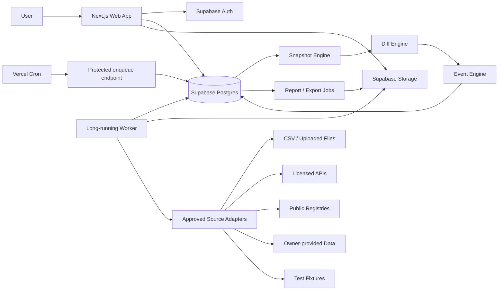
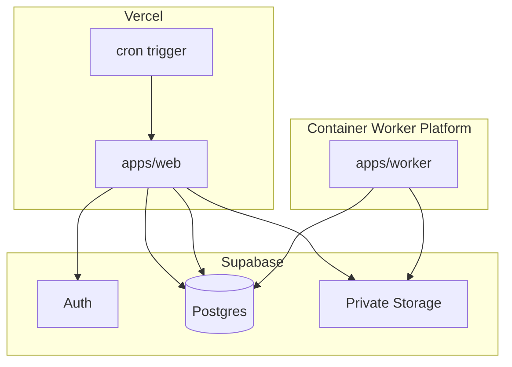
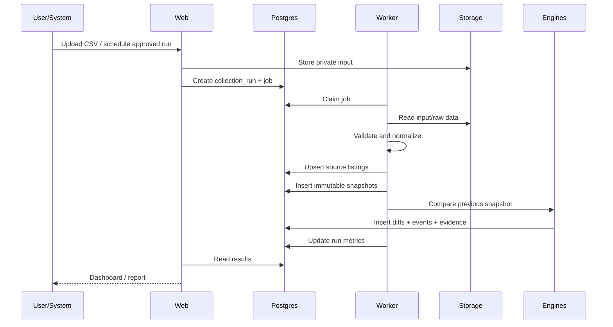

# 02. System Architecture

## 1. Architecture goals

Система должна быть:

- source-agnostic;
- history-first;
- evidence-backed;
- multi-tenant;
- idempotent;
- observable;
- безопасной;
- пригодной для постепенного роста;
- независимой от одного OTA;
- способной пережить изменение HTML, API или бизнес-модели источника без переписывания ядра.

---

## 2. High-level architecture



---

## 3. Deployment architecture



### Important

Vercel Cron не выполняет тяжёлый collection job. Он только вызывает защищённый endpoint, который ставит due jobs в очередь.

Browser-based или долгие jobs, если когда-либо будут разрешены, исполняются только в отдельном worker container.

---

## 4. Monorepo

```text
bali-accommodation-intelligence/
├── apps/
│   ├── web/
│   │   ├── src/app/
│   │   ├── src/components/
│   │   ├── src/features/
│   │   ├── src/lib/
│   │   └── tests/
│   └── worker/
│       ├── src/jobs/
│       ├── src/runners/
│       ├── src/observability/
│       └── tests/
├── packages/
│   ├── db/
│   │   ├── src/clients/
│   │   ├── src/repositories/
│   │   ├── src/generated/
│   │   └── src/queries/
│   ├── domain/
│   │   ├── src/entities/
│   │   ├── src/enums/
│   │   ├── src/schemas/
│   │   └── src/errors/
│   ├── source-sdk/
│   │   ├── src/adapter.ts
│   │   ├── src/compliance.ts
│   │   ├── src/registry.ts
│   │   └── src/types.ts
│   ├── snapshot-engine/
│   ├── event-engine/
│   ├── import-engine/
│   ├── reporting/
│   ├── ui/
│   ├── config/
│   └── test-fixtures/
├── supabase/
│   ├── migrations/
│   ├── seed.sql
│   ├── config.toml
│   └── tests/
├── docs/
├── scripts/
├── .github/workflows/
├── AGENTS.md
├── package.json
├── pnpm-workspace.yaml
├── turbo.json
├── tsconfig.base.json
├── .env.example
└── README.md
```

---

## 5. Technology stack

### 5.1 Web

- Next.js App Router;
- React;
- TypeScript strict mode;
- Tailwind CSS;
- shadcn/ui;
- Zod;
- React Hook Form;
- TanStack Table only if shadcn table composition becomes insufficient;
- MapLibre GL JS;
- date-fns or Temporal-compatible utility;
- server components by default;
- client components only for interactive filters, map, charts and forms.

### 5.2 Runtime

- Node.js 24 LTS;
- pnpm;
- pinned dependency versions;
- committed lockfile;
- no unpinned `latest` in committed package.json.

### 5.3 Data

- Supabase Postgres;
- Supabase Auth;
- Supabase Storage;
- PostGIS;
- SQL migrations;
- generated TypeScript database types;
- RLS for every exposed table;
- private schema for credentials, jobs, raw observations and operational internals.

### 5.4 Testing

- Vitest for unit tests;
- database integration tests against local Supabase;
- Playwright Test for E2E;
- fixture-based adapter tests;
- snapshot/event golden tests;
- accessibility smoke tests.

### 5.5 Observability

MVP:

- structured JSON logs;
- collection run metrics;
- job attempts and errors;
- request ID;
- run ID;
- source key;
- parser version;
- audit logs;
- health endpoints.

Optional after MVP:

- Sentry;
- OpenTelemetry;
- centralized log drain.

---

## 6. Application boundaries

## 6.1 `apps/web`

Responsibilities:

- public website;
- auth;
- dashboard rendering;
- organization and dataset authorization;
- Server Actions for in-app mutations;
- Route Handlers for uploads, exports, webhooks and cron;
- report previews;
- signed URLs;
- UI analytics events.

Must not:

- run long collection jobs;
- contain source credentials;
- expose service role to browser;
- parse very large files synchronously;
- make legal conclusions.

## 6.2 `apps/worker`

Responsibilities:

- poll job queue;
- acquire jobs safely;
- run imports;
- run approved adapters;
- normalize observations;
- create snapshots;
- compare snapshots;
- generate events;
- generate exports/reports;
- record logs and metrics;
- retry transient failures.

Must:

- use bounded concurrency;
- heartbeat running jobs;
- release stale jobs;
- enforce source compliance gate;
- be idempotent;
- handle shutdown gracefully;
- never log secrets.

## 6.3 `packages/domain`

Pure domain types and validation:

- enums;
- entity interfaces;
- Zod schemas;
- business errors;
- lifecycle transitions;
- event types;
- money representation;
- timestamps;
- confidence model.

No database or network imports.

## 6.4 `packages/db`

Responsibilities:

- lazy clients;
- generated database types;
- repositories;
- transaction helpers;
- keyset pagination;
- authorization-aware queries;
- job claim/release methods.

No UI.

## 6.5 `packages/source-sdk`

Responsibilities:

- adapter contract;
- compliance gate;
- source registry;
- capability declaration;
- raw observation contract;
- normalized observation contract;
- health checks;
- rate-limit metadata;
- fixture adapter.

No source-specific logic in core packages.

## 6.6 `packages/import-engine`

Responsibilities:

- file validation;
- header mapping;
- row parsing;
- rejected rows;
- deduplication;
- normalized observation creation;
- progress metrics;
- import idempotency.

## 6.7 `packages/snapshot-engine`

Responsibilities:

- select previous comparable snapshot;
- create immutable snapshot;
- calculate fingerprints;
- store raw evidence reference;
- update first_seen/last_seen;
- avoid duplicate snapshot insertion.

## 6.8 `packages/event-engine`

Responsibilities:

- field diff;
- materiality;
- lifecycle state machine;
- confidence;
- evidence;
- event idempotency;
- reactivation.

## 6.9 `packages/reporting`

Responsibilities:

- report definitions;
- immutable parameters;
- async CSV export;
- future PDF rendering;
- signed download URLs.

---

## 7. Source adapter contract

```ts
export type SourceCapability =
  | "listing_identity"
  | "listing_status"
  | "search_presence"
  | "title"
  | "rating"
  | "review_count"
  | "price"
  | "location"
  | "host_identity"
  | "direct_channels"
  | "amenities"
  | "content_fingerprint";

export type SourceComplianceStatus =
  | "approved"
  | "restricted"
  | "pending_review"
  | "disabled";

export interface SourceAdapterDefinition {
  key: string;
  displayName: string;
  accessMode:
    | "owner_supplied"
    | "licensed_api"
    | "public_registry"
    | "manual_import"
    | "browser_automation"
    | "demo_fixture";
  complianceStatus: SourceComplianceStatus;
  automationAllowed: boolean;
  capabilities: SourceCapability[];
  parserVersion: string;
}

export interface CollectionPlan {
  sourceKey: string;
  datasetId: string;
  regionIds?: string[];
  externalIds?: string[];
  requestedAt: string;
  requestedBy: string;
  configuration: Record<string, unknown>;
}

export interface RawObservation {
  sourceKey: string;
  externalId: string;
  observedAt: string;
  observationStatus:
    | "active"
    | "unavailable"
    | "not_found"
    | "search_not_observed"
    | "blocked"
    | "source_error"
    | "unknown";
  sourceUrl?: string;
  payload: unknown;
  evidence: {
    method: string;
    requestId?: string;
    objectPath?: string;
    notes?: string;
  };
}

export interface NormalizedListingObservation {
  sourceKey: string;
  externalId: string;
  sourceUrl?: string;
  observedAt: string;
  observationStatus: RawObservation["observationStatus"];

  title?: string;
  propertyType?: string;
  regionName?: string;
  latitude?: number;
  longitude?: number;

  rating?: number;
  reviewCount?: number;
  observedPrice?: {
    amount: string;
    currency: string;
    unit: "night" | "stay" | "unknown";
  };

  bedrooms?: number;
  bathrooms?: number;
  guestCapacity?: number;

  isSuperhost?: boolean;
  hostExternalId?: string;

  officialWebsite?: string;
  businessWhatsapp?: string;
  directBookingUrl?: string;

  titleHash?: string;
  descriptionHash?: string;
  photosHash?: string;
  amenitiesHash?: string;
  contentFingerprint: string;

  parserVersion: string;
  rawEvidenceObjectPath?: string;
}

export interface SourceAdapter {
  definition: SourceAdapterDefinition;

  validateConfiguration(
    config: Record<string, unknown>
  ): Promise<void>;

  healthCheck(): Promise<{
    ok: boolean;
    checkedAt: string;
    message?: string;
  }>;

  collect(
    plan: CollectionPlan,
    signal: AbortSignal
  ): AsyncIterable<RawObservation>;

  normalize(
    observation: RawObservation
  ): Promise<NormalizedListingObservation>;
}
```

### Required gate

До вызова `collect` worker обязан выполнить:

```ts
assertSourceExecutionAllowed(definition)
```

Функция бросает ошибку, если:

- compliance status не `approved`;
- automationAllowed = false для автоматического job;
- source review просрочен;
- requested capability не разрешена;
- required agreement/config отсутствует.

---

## 8. Data ingestion pipeline



### Detailed steps

1. Create `collection_run`.
2. Create one or more `collection_jobs`.
3. Claim job.
4. Verify source compliance.
5. Read input.
6. Validate schema.
7. Parse each row.
8. Reject invalid rows with reason.
9. Normalize.
10. Resolve source listing by `(source_id, external_id)`.
11. Resolve or create canonical property.
12. Insert immutable snapshot.
13. Find previous valid comparable snapshot.
14. Calculate field-level diff.
15. Evaluate lifecycle transition.
16. Insert events and evidence.
17. Update derived current state.
18. Update run counters.
19. Mark job and run complete.
20. Notify UI/report pipeline.

---

## 9. Job queue architecture

MVP uses Postgres, not Redis.

### 9.1 Why

- fewer moving parts;
- transactional creation of jobs;
- enough for MVP volume;
- easy auditability;
- one source of truth.

### 9.2 Claim query pattern

Worker must claim jobs atomically using a transaction and `FOR UPDATE SKIP LOCKED`.

Conceptual SQL:

```sql
with next_job as (
  select id
  from private.collection_jobs
  where status = 'queued'
    and scheduled_for <= now()
  order by priority desc, scheduled_for asc, created_at asc
  for update skip locked
  limit 1
)
update private.collection_jobs j
set
  status = 'running',
  locked_at = now(),
  locked_by = :worker_id,
  started_at = coalesce(started_at, now()),
  attempts = attempts + 1
from next_job
where j.id = next_job.id
returning j.*;
```

### 9.3 Heartbeat

Running worker updates:

- `heartbeat_at`;
- progress current;
- progress total;
- current stage.

### 9.4 Stale job recovery

A periodic maintenance job returns stale running jobs to `retry_wait` when:

- heartbeat older than timeout;
- attempt count below max attempts;
- job is retryable.

Permanent errors become `failed`.

### 9.5 Retry policy

Default:

- max attempts: 3;
- exponential delay;
- transient network/source errors retry;
- validation and compliance errors do not retry automatically;
- idempotency key prevents duplicate effects.

### 9.6 Scale threshold

Evaluate a dedicated queue when any is true:

- over 100,000 jobs/day;
- frequent lock contention;
- delayed jobs exceed acceptable lag;
- long-running workflows require fan-out;
- independent priority queues are needed.

---

## 10. Snapshot architecture

Snapshots are immutable observations.

### 10.1 Snapshot layers

1. Raw evidence in private Storage.
2. Normalized snapshot in Postgres.
3. Current-state projection on source listing.
4. Canonical property summary.
5. Events derived from snapshot comparison.

### 10.2 Fingerprints

Use deterministic hashes for large or noisy fields:

- `title_hash`;
- `description_hash`;
- `photos_hash`;
- `amenities_hash`;
- `content_fingerprint`.

Normalization before hashing:

- Unicode normalize;
- trim;
- collapse whitespace;
- lower-case where case is not meaningful;
- sort sets such as amenities/photo identifiers;
- remove volatile tracking query strings;
- do not hash timestamps or session-specific data.

### 10.3 Comparable snapshots

A snapshot is comparable only when:

- same source listing;
- parser versions are compatible, or migration rule exists;
- status is not source_error/blocked unless comparing status itself;
- source coverage mode is equivalent;
- required fields were actually observed.

---

## 11. Canonical property resolution

### 11.1 MVP

- exact source listing identity;
- one source listing initially maps to one canonical property;
- manual merge/split;
- import may include explicit `canonical_property_key`;
- no opaque AI auto-merge.

### 11.2 Candidate matching

System may suggest candidates using:

- normalized name;
- distance;
- official website domain;
- phone/WhatsApp;
- source IDs;
- bedroom count;
- image fingerprints where legally permitted.

Suggestion must include reasons and score.

### 11.3 Merge rules

Merge:

- retains all source listings;
- creates audit event;
- redirects old property IDs;
- recomputes current summary;
- does not delete snapshots.

Split:

- moves selected source listings;
- keeps evidence and history;
- records actor and reason.

---

## 12. Web rendering strategy

### Server Components

Use for:

- overview data;
- property tables;
- property header;
- reports list;
- imports list;
- auth-protected layouts.

### Client Components

Use for:

- map;
- interactive charts;
- complex filter builder;
- table column controls;
- upload mapping wizard;
- dialogs;
- optimistic watchlist actions.

### Server Actions

Use for:

- create/update watchlist;
- add note;
- mark event reviewed;
- change lead stage;
- update settings.

### Route Handlers

Use for:

- cron endpoint;
- upload initiation;
- import confirmation;
- webhooks;
- large exports;
- signed downloads;
- health checks;
- future external API.

### Caching

- never share user-private cached responses across organizations;
- use request-scoped or private caching for org-specific data;
- cache public methodology pages;
- invalidate summaries after completed run;
- do not cache rapidly changing job status for long periods.

---

## 13. API design

### 13.1 Internal HTTP endpoints

```text
GET    /api/health
GET    /api/ready

POST   /api/imports/presign
POST   /api/imports
GET    /api/imports/:id
POST   /api/imports/:id/cancel
GET    /api/imports/:id/rejections

POST   /api/exports
GET    /api/exports/:id
GET    /api/exports/:id/download

POST   /api/reports
GET    /api/reports/:id

GET    /api/search

GET    /api/cron/enqueue-due-jobs
POST   /api/webhooks/:provider
```

Most dashboard CRUD uses Server Actions rather than duplicating an internal REST API.

### 13.2 Future public API

Not in MVP, but namespace is reserved:

```text
/api/v1/properties
/api/v1/source-listings
/api/v1/events
/api/v1/reports
```

Future API requirements:

- API keys;
- organization entitlements;
- rate limits;
- cursor pagination;
- versioning;
- OpenAPI;
- audit.

---

## 14. File uploads and storage

### Buckets

| Bucket | Visibility | Content |
|---|---|---|
| `import-files` | private | uploaded CSV |
| `raw-observations` | private | raw evidence |
| `report-files` | private | exports/reports |
| `owner-assets` | private by default | owner-authorized media |
| `public-assets` | public | product-owned marketing assets |

### Rules

- signed upload/download URLs;
- MIME and size validation;
- virus scanning can be added later;
- file names are not trusted;
- use generated object keys;
- retention policy by bucket;
- no third-party copyrighted photo rehosting without permission.

---

## 15. Security architecture

### 15.1 Authentication

- Supabase Auth;
- email magic link or email/password for MVP;
- MFA later;
- session handled server-side;
- protected app layout;
- revalidate authorization on sensitive mutations.

### 15.2 Authorization

- organization memberships;
- dataset access;
- role capabilities;
- server-side checks;
- RLS on exposed tables;
- no authorization from user-editable metadata.

### 15.3 Secrets

- never expose service role;
- frontend uses publishable key only;
- worker secrets are server environment variables;
- source credentials never enter browser;
- `.env.example` contains names only;
- logs redact headers, tokens and personal data.

### 15.4 Database

- public tables have RLS;
- private schema is not exposed;
- explicit grants;
- security-invoker views;
- indexes on RLS predicates;
- no public SECURITY DEFINER functions;
- audit all privileged operations.

### 15.5 Cron

`GET /api/cron/enqueue-due-jobs` validates:

```text
Authorization: Bearer ${CRON_SECRET}
```

Unauthorized returns 401.

### 15.6 Rate limiting

MVP:

- login handled by Auth provider;
- upload endpoints rate-limited per org/user;
- search endpoint rate-limited;
- public request-access rate-limited and spam-protected;
- future public API has separate quotas.

---

## 16. Data quality architecture

Every record should expose:

- source;
- observed_at;
- parser_version;
- observation_status;
- confidence;
- last_successful_run;
- coverage context;
- evidence.

### Data quality flags

```text
missing_external_id
invalid_url
invalid_coordinates
coordinates_outside_bali
rating_out_of_range
negative_review_count
unknown_currency
duplicate_row
parser_version_mismatch
coverage_drop
source_error_spike
unusually_large_change
entity_resolution_conflict
```

Runs with severe coverage drop should not generate mass inactivity events automatically.

Example guard:

```text
If current valid observations < 70% of previous run
AND source reports elevated errors,
mark run as degraded and suppress inactivity transitions.
```

Threshold must be configurable per source/dataset.

---

## 17. Performance targets

MVP target dataset:

- 25,000 source listings;
- weekly snapshots;
- 1,300,000 normalized snapshots after one year;
- up to 100 users;
- up to 20 organizations.

Targets:

- property list query p95 below 750 ms at database layer with filters;
- overview query p95 below 1.5 s;
- 25,000-row CSV import completes asynchronously within 10 minutes under normal worker capacity;
- UI remains responsive while jobs run;
- export is asynchronous above 10,000 rows;
- no N+1 queries on table pages;
- cursor pagination;
- materialized summaries for expensive overview analytics when needed.

These are engineering targets, not public claims.

---

## 18. Reliability

### Idempotency

Required keys:

- import file checksum;
- collection run idempotency key;
- source listing unique key;
- snapshot fingerprint;
- event deduplication key;
- export request hash.

### Transactions

Use transactions for:

- job claim;
- source listing + snapshot association;
- lifecycle state update + event insert;
- property merge/split;
- membership changes.

### Partial failure

One invalid row must not fail a whole import unless configured threshold exceeded.

Import result includes:

- accepted;
- rejected;
- duplicates;
- created;
- updated;
- unchanged;
- events;
- warnings.

---

## 19. Scheduler

MVP schedule:

- daily enqueue check at 00:15 UTC;
- stale job recovery every 15 minutes, if plan allows;
- weekly maintenance;
- reports scheduled per organization later.

`vercel.json` example:

```json
{
  "crons": [
    {
      "path": "/api/cron/enqueue-due-jobs",
      "schedule": "15 0 * * *"
    }
  ]
}
```

Do not rely on Vercel Cron for exact execution time. Job due time lives in database.

---

## 20. Environment variables

```text
NEXT_PUBLIC_SUPABASE_URL=
NEXT_PUBLIC_SUPABASE_PUBLISHABLE_KEY=

SUPABASE_SERVICE_ROLE_KEY=
SUPABASE_DB_URL=

CRON_SECRET=
WORKER_ID=
WORKER_POLL_INTERVAL_MS=
WORKER_CONCURRENCY=

APP_URL=
APP_TIMEZONE=Asia/Makassar

MAP_STYLE_URL=
MAP_TILE_API_KEY=

ANALYTICS_PROVIDER=
SENTRY_DSN=
```

Rules:

- server-only variables never begin with `NEXT_PUBLIC_`;
- fail fast at runtime with Zod env validation;
- database/service clients are lazy initialized;
- test environment uses separate project/local stack.

---

## 21. CI pipeline

On pull request:

1. install pinned dependencies;
2. lint;
3. typecheck;
4. unit tests;
5. database schema tests;
6. build;
7. selected E2E smoke tests;
8. dependency audit;
9. verify generated database types are current.

On main:

- repeat all checks;
- deploy preview/production according to branch policy;
- apply migrations through controlled workflow;
- run smoke test;
- do not auto-enable a source adapter.

---

## 22. Architecture decision records

Create `docs/adr/`.

Required ADRs:

```text
0001-source-agnostic-domain-model.md
0002-postgres-job-queue-for-mvp.md
0003-separate-long-running-worker.md
0004-evidence-backed-lifecycle-state.md
0005-dataset-based-multi-tenancy.md
0006-no-unauthorized-live-scraping.md
0007-immutable-snapshots.md
0008-manual-entity-resolution-first.md
```

Each ADR contains:

- context;
- decision;
- consequences;
- alternatives;
- date;
- status.
