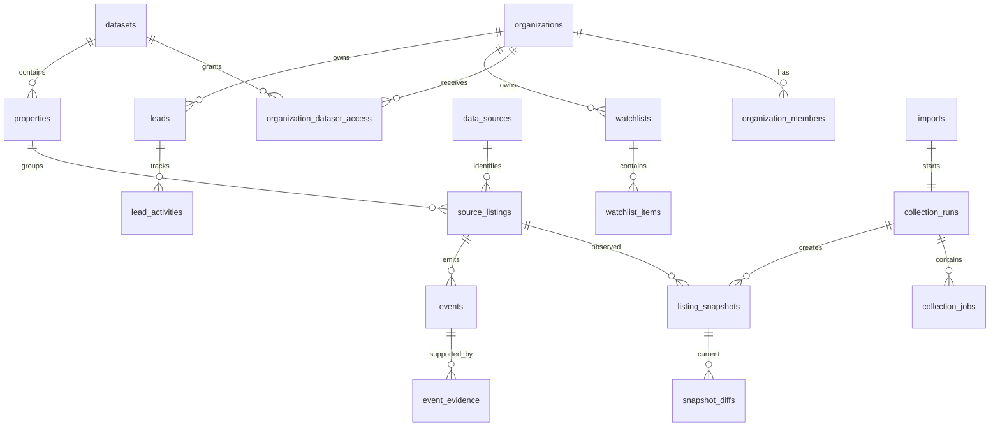

# 03. Database Schema

## 1. Database conventions

- PostgreSQL through Supabase.
- UUID primary keys.
- `timestamptz` for all timestamps.
- UTC storage.
- `created_at` and `updated_at` where mutable.
- Immutable snapshots and events.
- `snake_case`.
- Money stored as `numeric`, never float.
- Currency stored as ISO 4217 `char(3)` where known.
- Coordinates use PostGIS geography.
- User-facing tables in `public`.
- Operational secrets/raw payloads in `private`.
- Analytics views in `analytics`.
- RLS on every exposed table.
- Explicit grants for Data API access.
- Soft deletion only where history matters.
- No guest personal data.

---

## 2. Extensions

Required:

```sql
create extension if not exists pgcrypto;
create extension if not exists postgis;
create extension if not exists citext;
```

Optional later:

```sql
create extension if not exists pg_trgm;
```

---

## 3. Enums

Create enums in a dedicated `app` schema or use check constraints if migration portability is preferred.

```text
member_role:
  owner
  admin
  analyst
  viewer

dataset_status:
  active
  paused
  archived

source_access_mode:
  owner_supplied
  licensed_api
  public_registry
  manual_import
  browser_automation
  demo_fixture

source_compliance_status:
  approved
  restricted
  pending_review
  disabled

observation_status:
  active
  unavailable
  not_found
  search_not_observed
  blocked
  source_error
  unknown

listing_lifecycle_status:
  active
  first_miss
  suspected_inactive
  confirmed_inactive
  reactivated
  archived

confidence_level:
  low
  medium
  high

collection_run_status:
  pending
  queued
  running
  completed
  completed_with_errors
  degraded
  failed
  cancelled

job_status:
  queued
  running
  retry_wait
  succeeded
  failed
  cancelled

job_type:
  import
  collect
  normalize
  compare
  report
  export
  notify
  maintenance

event_type:
  listing_created
  listing_first_miss
  listing_suspected_inactive
  listing_confirmed_inactive
  listing_reactivated
  listing_archived
  price_changed
  rating_changed
  review_count_changed
  title_changed
  description_changed
  photos_changed
  amenities_changed
  host_changed
  superhost_gained
  superhost_lost
  location_changed
  direct_channel_added
  direct_channel_removed
  source_error
  manual_correction
  property_merged
  property_split

lead_stage:
  new
  research
  ready_to_contact
  contacted
  replied
  qualified
  converted
  not_relevant
  do_not_contact

import_status:
  uploaded
  validating
  ready
  processing
  completed
  completed_with_errors
  failed
  cancelled

report_status:
  queued
  generating
  ready
  failed
  expired
```

---

## 4. Schema map



---

## 5. Identity and tenancy tables

## 5.1 `public.profiles`

One row per Supabase Auth user.

| Field | Type | Rules |
|---|---|---|
| `id` | uuid | PK, references `auth.users(id)` |
| `full_name` | text | nullable |
| `avatar_url` | text | nullable |
| `timezone` | text | default `Asia/Makassar` |
| `created_at` | timestamptz | default now |
| `updated_at` | timestamptz | default now |

RLS:

- user can read/update own profile;
- system owner may read all through server-only admin path.

## 5.2 `public.organizations`

| Field | Type | Rules |
|---|---|---|
| `id` | uuid | PK |
| `name` | text | required |
| `slug` | citext | unique |
| `status` | text | active/suspended/archived |
| `plan_code` | text | default `internal_beta` |
| `default_timezone` | text | default `Asia/Makassar` |
| `created_at` | timestamptz | default now |
| `updated_at` | timestamptz | default now |

## 5.3 `public.organization_members`

| Field | Type | Rules |
|---|---|---|
| `organization_id` | uuid | FK organizations |
| `user_id` | uuid | FK auth.users |
| `role` | member_role | required |
| `invited_by` | uuid | nullable |
| `created_at` | timestamptz | default now |

Primary key:

```text
(organization_id, user_id)
```

Indexes:

- `(user_id, organization_id)`;
- `(organization_id, role)`.

## 5.4 `public.datasets`

Dataset is a shareable collection of market observations.

| Field | Type | Rules |
|---|---|---|
| `id` | uuid | PK |
| `name` | text | required |
| `slug` | citext | unique |
| `description` | text | nullable |
| `status` | dataset_status | required |
| `owner_organization_id` | uuid | nullable |
| `coverage_country_code` | char(2) | default `ID` |
| `coverage_region` | text | default `Bali` |
| `default_timezone` | text | default `Asia/Makassar` |
| `created_at` | timestamptz | default now |
| `updated_at` | timestamptz | default now |

## 5.5 `public.organization_dataset_access`

| Field | Type | Rules |
|---|---|---|
| `organization_id` | uuid | FK |
| `dataset_id` | uuid | FK |
| `access_level` | text | read/manage |
| `created_at` | timestamptz | default now |

Primary key:

```text
(organization_id, dataset_id)
```

---

## 6. Geographic tables

## 6.1 `public.regions`

Hierarchical Bali geography.

| Field | Type | Rules |
|---|---|---|
| `id` | uuid | PK |
| `parent_id` | uuid | self FK nullable |
| `name` | text | required |
| `slug` | citext | required |
| `region_type` | text | province/regency/district/village/area |
| `country_code` | char(2) | default ID |
| `geometry` | geography(MultiPolygon,4326) | nullable |
| `centroid` | geography(Point,4326) | nullable |
| `created_at` | timestamptz | default now |

Unique:

```text
(parent_id, slug)
```

Indexes:

- GiST `geometry`;
- GiST `centroid`;
- `(parent_id, region_type)`.

---

## 7. Source registry

## 7.1 `private.data_sources`

| Field | Type | Rules |
|---|---|---|
| `id` | uuid | PK |
| `key` | citext | unique |
| `display_name` | text | required |
| `access_mode` | source_access_mode | required |
| `compliance_status` | source_compliance_status | required |
| `automation_allowed` | boolean | default false |
| `capabilities` | text[] | required |
| `terms_reviewed_at` | timestamptz | nullable |
| `review_expires_at` | timestamptz | nullable |
| `reviewed_by` | uuid | nullable |
| `restriction_reason` | text | nullable |
| `configuration_schema` | jsonb | nullable |
| `rate_limit_policy` | jsonb | nullable |
| `created_at` | timestamptz | default now |
| `updated_at` | timestamptz | default now |

No Data API grant.

## 7.2 `private.parser_versions`

| Field | Type |
|---|---|
| `id` | uuid PK |
| `source_id` | uuid FK |
| `version` | text |
| `schema_version` | integer |
| `compatible_with_previous` | boolean |
| `released_at` | timestamptz |
| `notes` | text |
| `is_active` | boolean |

Unique:

```text
(source_id, version)
```

---

## 8. Property and listing tables

## 8.1 `public.properties`

Canonical physical accommodation.

| Field | Type | Rules |
|---|---|---|
| `id` | uuid | PK |
| `dataset_id` | uuid | required FK |
| `canonical_name` | text | required |
| `slug` | citext | nullable |
| `property_type` | text | nullable |
| `primary_region_id` | uuid | nullable |
| `location` | geography(Point,4326) | nullable |
| `coordinate_precision_meters` | integer | nullable |
| `bedrooms` | numeric(4,1) | nullable |
| `bathrooms` | numeric(4,1) | nullable |
| `guest_capacity` | integer | nullable |
| `official_website` | text | nullable |
| `business_whatsapp` | text | nullable |
| `direct_booking_url` | text | nullable |
| `owner_verified` | boolean | default false |
| `verification_source` | text | nullable |
| `current_lifecycle_status` | listing_lifecycle_status | nullable |
| `current_confidence` | confidence_level | nullable |
| `first_observed_at` | timestamptz | nullable |
| `last_observed_at` | timestamptz | nullable |
| `created_at` | timestamptz | default now |
| `updated_at` | timestamptz | default now |
| `archived_at` | timestamptz | nullable |

Unique:

```text
(dataset_id, slug) where slug is not null
```

Indexes:

- `(dataset_id, current_lifecycle_status)`;
- `(dataset_id, primary_region_id)`;
- `(dataset_id, last_observed_at desc)`;
- GiST `location`;
- trigram index on canonical_name later.

## 8.2 `public.property_aliases`

| Field | Type |
|---|---|
| `id` | uuid PK |
| `property_id` | uuid FK |
| `alias` | text |
| `source` | text |
| `created_at` | timestamptz |

Unique:

```text
(property_id, lower(alias))
```

## 8.3 `public.source_listings`

A channel-specific listing or record.

| Field | Type | Rules |
|---|---|---|
| `id` | uuid | PK |
| `dataset_id` | uuid | required |
| `property_id` | uuid | required |
| `source_id` | uuid | required |
| `external_id` | text | required |
| `source_url` | text | nullable |
| `current_title` | text | nullable |
| `current_observation_status` | observation_status | nullable |
| `current_lifecycle_status` | listing_lifecycle_status | default active |
| `current_confidence` | confidence_level | default low |
| `first_seen_at` | timestamptz | required |
| `last_seen_active_at` | timestamptz | nullable |
| `last_observed_at` | timestamptz | required |
| `consecutive_misses` | integer | default 0 |
| `first_miss_at` | timestamptz | nullable |
| `suspected_inactive_at` | timestamptz | nullable |
| `confirmed_inactive_at` | timestamptz | nullable |
| `reactivated_at` | timestamptz | nullable |
| `latest_snapshot_id` | uuid | nullable, FK added after snapshot table |
| `host_external_id` | text | nullable |
| `official_website` | text | nullable |
| `business_whatsapp` | text | nullable |
| `direct_booking_url` | text | nullable |
| `created_at` | timestamptz | default now |
| `updated_at` | timestamptz | default now |
| `archived_at` | timestamptz | nullable |

Unique:

```text
(dataset_id, source_id, external_id)
```

Indexes:

- `(dataset_id, source_id, current_lifecycle_status)`;
- `(dataset_id, last_observed_at desc)`;
- `(property_id, source_id)`;
- `(source_id, external_id)`;
- `(host_external_id)` where not null.

---

## 9. Collection and import tables

## 9.1 `public.imports`

User-facing import record.

| Field | Type |
|---|---|
| `id` | uuid PK |
| `organization_id` | uuid FK |
| `dataset_id` | uuid FK |
| `source_id` | uuid FK |
| `status` | import_status |
| `input_object_path` | text |
| `original_filename` | text |
| `file_checksum` | text |
| `column_mapping` | jsonb |
| `requested_by` | uuid |
| `collection_run_id` | uuid nullable |
| `total_rows` | integer default 0 |
| `accepted_rows` | integer default 0 |
| `rejected_rows` | integer default 0 |
| `duplicate_rows` | integer default 0 |
| `warning_count` | integer default 0 |
| `created_at` | timestamptz |
| `started_at` | timestamptz nullable |
| `finished_at` | timestamptz nullable |
| `error_summary` | text nullable |

Unique idempotency option:

```text
(organization_id, dataset_id, source_id, file_checksum)
```

Allow explicit `force_reimport` only to system admin.

## 9.2 `private.collection_runs`

| Field | Type |
|---|---|
| `id` | uuid PK |
| `dataset_id` | uuid FK |
| `source_id` | uuid FK |
| `run_kind` | text |
| `status` | collection_run_status |
| `idempotency_key` | text unique |
| `requested_by_user_id` | uuid nullable |
| `requested_by_system` | text nullable |
| `parser_version` | text |
| `coverage_spec` | jsonb |
| `started_at` | timestamptz nullable |
| `finished_at` | timestamptz nullable |
| `total_observations` | integer default 0 |
| `valid_observations` | integer default 0 |
| `active_observations` | integer default 0 |
| `error_observations` | integer default 0 |
| `rejected_observations` | integer default 0 |
| `coverage_ratio` | numeric(8,5) nullable |
| `is_degraded` | boolean default false |
| `degradation_reason` | text nullable |
| `metrics` | jsonb |
| `created_at` | timestamptz |

Indexes:

- `(dataset_id, source_id, created_at desc)`;
- `(status, created_at)`;
- `(is_degraded, source_id)`.

## 9.3 `private.collection_jobs`

| Field | Type |
|---|---|
| `id` | uuid PK |
| `collection_run_id` | uuid nullable |
| `job_type` | job_type |
| `status` | job_status |
| `priority` | integer default 0 |
| `idempotency_key` | text unique |
| `payload` | jsonb |
| `scheduled_for` | timestamptz default now |
| `attempts` | integer default 0 |
| `max_attempts` | integer default 3 |
| `locked_by` | text nullable |
| `locked_at` | timestamptz nullable |
| `heartbeat_at` | timestamptz nullable |
| `started_at` | timestamptz nullable |
| `finished_at` | timestamptz nullable |
| `progress_current` | integer nullable |
| `progress_total` | integer nullable |
| `progress_stage` | text nullable |
| `last_error_code` | text nullable |
| `last_error_message` | text nullable |
| `created_at` | timestamptz |

Indexes:

- partial `(priority desc, scheduled_for, created_at)` where status = queued;
- `(status, heartbeat_at)`;
- `(collection_run_id)`.

## 9.4 `private.job_logs`

| Field | Type |
|---|---|
| `id` | bigint identity PK |
| `job_id` | uuid FK |
| `level` | text |
| `message` | text |
| `context` | jsonb |
| `created_at` | timestamptz |

Retention: 90 days initially.

## 9.5 `private.raw_observations`

Metadata only; large payload in private Storage.

| Field | Type |
|---|---|
| `id` | uuid PK |
| `collection_run_id` | uuid FK |
| `source_listing_id` | uuid nullable |
| `source_id` | uuid FK |
| `external_id` | text |
| `observed_at` | timestamptz |
| `observation_status` | observation_status |
| `object_path` | text nullable |
| `payload_checksum` | text |
| `request_metadata` | jsonb |
| `created_at` | timestamptz |

Unique:

```text
(collection_run_id, source_id, external_id, payload_checksum)
```

## 9.6 `public.import_rejections`

| Field | Type |
|---|---|
| `id` | bigint identity PK |
| `import_id` | uuid FK |
| `row_number` | integer |
| `error_code` | text |
| `error_message` | text |
| `raw_row` | jsonb |
| `created_at` | timestamptz |

RLS: organization can read its own import rejections.

---

## 10. Snapshot tables

## 10.1 `public.listing_snapshots`

Immutable normalized observation.

| Field | Type | Rules |
|---|---|---|
| `id` | uuid | PK |
| `dataset_id` | uuid | required |
| `source_listing_id` | uuid | required |
| `collection_run_id` | uuid | required |
| `raw_observation_id` | uuid | nullable |
| `observed_at` | timestamptz | required |
| `observation_status` | observation_status | required |
| `title` | text | nullable |
| `property_type` | text | nullable |
| `region_id` | uuid | nullable |
| `location` | geography(Point,4326) | nullable |
| `rating` | numeric(3,2) | nullable, 0..5 |
| `review_count` | integer | nullable, >=0 |
| `observed_price_amount` | numeric(14,2) | nullable |
| `observed_price_currency` | char(3) | nullable |
| `observed_price_unit` | text | nullable |
| `bedrooms` | numeric(4,1) | nullable |
| `bathrooms` | numeric(4,1) | nullable |
| `guest_capacity` | integer | nullable |
| `is_superhost` | boolean | nullable |
| `host_external_id` | text | nullable |
| `official_website` | text | nullable |
| `business_whatsapp` | text | nullable |
| `direct_booking_url` | text | nullable |
| `title_hash` | text | nullable |
| `description_hash` | text | nullable |
| `photos_hash` | text | nullable |
| `amenities_hash` | text | nullable |
| `content_fingerprint` | text | required |
| `parser_version` | text | required |
| `field_presence` | jsonb | required |
| `quality_flags` | text[] | default empty |
| `created_at` | timestamptz | default now |

Unique idempotency:

```text
(source_listing_id, collection_run_id)
```

Indexes:

- `(source_listing_id, observed_at desc)`;
- `(dataset_id, observed_at desc)`;
- `(dataset_id, observation_status, observed_at desc)`;
- `(dataset_id, region_id, observed_at desc)`;
- `(content_fingerprint)`;
- GiST `location`.

Potential monthly partitioning only after measured need.

## 10.2 `public.snapshot_diffs`

Immutable field-level comparison.

| Field | Type |
|---|---|
| `id` | uuid PK |
| `dataset_id` | uuid |
| `source_listing_id` | uuid |
| `previous_snapshot_id` | uuid nullable |
| `current_snapshot_id` | uuid |
| `field_name` | text |
| `previous_value` | jsonb nullable |
| `current_value` | jsonb nullable |
| `change_kind` | text |
| `absolute_delta` | numeric nullable |
| `percent_delta` | numeric nullable |
| `is_material` | boolean |
| `rule_version` | text |
| `created_at` | timestamptz |

Unique:

```text
(current_snapshot_id, field_name, rule_version)
```

Indexes:

- `(source_listing_id, created_at desc)`;
- `(dataset_id, field_name, is_material)`;
- `(current_snapshot_id)`.

---

## 11. Event tables

## 11.1 `public.events`

| Field | Type |
|---|---|
| `id` | uuid PK |
| `dataset_id` | uuid |
| `property_id` | uuid |
| `source_listing_id` | uuid nullable |
| `event_type` | event_type |
| `event_at` | timestamptz |
| `detected_at` | timestamptz default now |
| `confidence` | confidence_level |
| `title` | text |
| `summary` | text |
| `previous_value` | jsonb nullable |
| `current_value` | jsonb nullable |
| `rule_version` | text |
| `deduplication_key` | text unique |
| `is_reviewed` | boolean default false |
| `reviewed_by` | uuid nullable |
| `reviewed_at` | timestamptz nullable |
| `dismissed_at` | timestamptz nullable |
| `dismissal_reason` | text nullable |
| `created_at` | timestamptz |

Indexes:

- `(dataset_id, event_at desc)`;
- `(dataset_id, event_type, event_at desc)`;
- `(property_id, event_at desc)`;
- `(source_listing_id, event_at desc)`;
- partial `(dataset_id, is_reviewed, event_at desc)` where dismissed_at is null.

## 11.2 `public.event_evidence`

| Field | Type |
|---|---|
| `id` | uuid PK |
| `event_id` | uuid FK |
| `previous_snapshot_id` | uuid nullable |
| `current_snapshot_id` | uuid nullable |
| `collection_run_id` | uuid nullable |
| `raw_observation_id` | uuid nullable |
| `evidence_type` | text |
| `explanation` | text |
| `metadata` | jsonb |
| `created_at` | timestamptz |

Every non-manual event must have at least one evidence row.

## 11.3 `public.manual_corrections`

| Field | Type |
|---|---|
| `id` | uuid PK |
| `dataset_id` | uuid |
| `target_type` | text |
| `target_id` | uuid |
| `correction_type` | text |
| `previous_value` | jsonb |
| `new_value` | jsonb |
| `reason` | text |
| `created_by` | uuid |
| `created_at` | timestamptz |

Corrections append history. They do not rewrite snapshots.

---

## 12. Watchlists and saved filters

## 12.1 `public.watchlists`

| Field | Type |
|---|---|
| `id` | uuid PK |
| `organization_id` | uuid |
| `dataset_id` | uuid |
| `name` | text |
| `description` | text nullable |
| `created_by` | uuid |
| `created_at` | timestamptz |
| `updated_at` | timestamptz |

Unique:

```text
(organization_id, dataset_id, lower(name))
```

## 12.2 `public.watchlist_items`

| Field | Type |
|---|---|
| `id` | uuid PK |
| `watchlist_id` | uuid |
| `item_type` | text |
| `property_id` | uuid nullable |
| `source_listing_id` | uuid nullable |
| `region_id` | uuid nullable |
| `saved_filter` | jsonb nullable |
| `created_by` | uuid |
| `created_at` | timestamptz |

Constraint: exactly one target type populated.

## 12.3 `public.notification_rules`

| Field | Type |
|---|---|
| `id` | uuid PK |
| `organization_id` | uuid |
| `watchlist_id` | uuid nullable |
| `name` | text |
| `event_types` | text[] |
| `minimum_confidence` | confidence_level |
| `channel` | text |
| `destination` | text |
| `schedule` | text |
| `enabled` | boolean |
| `created_by` | uuid |
| `created_at` | timestamptz |
| `updated_at` | timestamptz |

Actual email delivery may be v1.1. Table can exist behind flag.

---

## 13. Leads

## 13.1 `public.leads`

| Field | Type |
|---|---|
| `id` | uuid PK |
| `organization_id` | uuid |
| `dataset_id` | uuid |
| `property_id` | uuid |
| `source_listing_id` | uuid nullable |
| `stage` | lead_stage |
| `priority` | integer default 0 |
| `reason_code` | text |
| `reason_text` | text |
| `contact_name` | text nullable |
| `contact_role` | text nullable |
| `business_email` | citext nullable |
| `business_whatsapp` | text nullable |
| `website` | text nullable |
| `instagram` | text nullable |
| `contact_source_url` | text nullable |
| `contact_data_basis` | text nullable |
| `assigned_to` | uuid nullable |
| `last_activity_at` | timestamptz nullable |
| `next_action_at` | timestamptz nullable |
| `do_not_contact` | boolean default false |
| `created_by` | uuid |
| `created_at` | timestamptz |
| `updated_at` | timestamptz |

Unique optional:

```text
(organization_id, property_id)
```

## 13.2 `public.lead_activities`

| Field | Type |
|---|---|
| `id` | uuid PK |
| `lead_id` | uuid |
| `activity_type` | text |
| `body` | text nullable |
| `previous_stage` | lead_stage nullable |
| `new_stage` | lead_stage nullable |
| `created_by` | uuid |
| `created_at` | timestamptz |

---

## 14. Notes

## 14.1 `public.property_notes`

| Field | Type |
|---|---|
| `id` | uuid PK |
| `organization_id` | uuid |
| `property_id` | uuid |
| `body` | text |
| `created_by` | uuid |
| `created_at` | timestamptz |
| `updated_at` | timestamptz |
| `deleted_at` | timestamptz nullable |

Notes are private to organization.

---

## 15. Reports and exports

## 15.1 `public.reports`

| Field | Type |
|---|---|
| `id` | uuid PK |
| `organization_id` | uuid |
| `dataset_id` | uuid |
| `report_type` | text |
| `name` | text |
| `parameters` | jsonb |
| `status` | report_status |
| `output_object_path` | text nullable |
| `requested_by` | uuid |
| `created_at` | timestamptz |
| `ready_at` | timestamptz nullable |
| `expires_at` | timestamptz nullable |
| `error_summary` | text nullable |

## 15.2 `public.exports`

Same pattern with:

- export_type;
- format;
- filters;
- row_count;
- output_object_path.

Exports over 10,000 rows are always async.

---

## 16. Audit and analytics

## 16.1 `public.audit_logs`

| Field | Type |
|---|---|
| `id` | bigint identity PK |
| `organization_id` | uuid nullable |
| `actor_user_id` | uuid nullable |
| `actor_type` | text |
| `action` | text |
| `target_type` | text |
| `target_id` | text |
| `request_id` | text nullable |
| `ip_hash` | text nullable |
| `metadata` | jsonb |
| `created_at` | timestamptz |

No sensitive raw secrets.

## 16.2 `private.product_analytics_events`

Optional internal analytics.

No guest PII and no contact body content.

---

## 17. RLS model

### 17.1 Helper functions

Create safe helper functions in non-exposed schema:

```text
private.user_has_org_role(user_id, organization_id, allowed_roles[])
private.user_can_access_dataset(user_id, dataset_id)
private.user_can_manage_dataset(user_id, dataset_id)
```

Avoid public SECURITY DEFINER. If SECURITY DEFINER is required:

- private schema;
- fixed search_path;
- explicit `auth.uid()` validation;
- revoke execute from public;
- grant only intended roles;
- test with database advisors.

### 17.2 Dataset-scoped tables

SELECT allowed when:

```text
exists organization membership
and organization has dataset access
```

Mutation allowed only for manage role or appropriate organization role.

### 17.3 Organization-private tables

`watchlists`, `leads`, `notes`, `reports`, `imports`:

```text
organization_id belongs to current user membership
```

### 17.4 Admin tables

No anon/authenticated Data API grants. Access via server-only admin repository.

### 17.5 Views

All exposed views:

```sql
with (security_invoker = true)
```

---

## 18. Explicit grants

Codex must not assume new public tables are automatically available through the Data API.

For each intended client-facing table:

1. enable RLS;
2. grant minimum required privileges;
3. add policies;
4. test as anon/authenticated;
5. ensure private tables have no grant.

---

## 19. Derived views

Create only after base queries work.

Suggested:

```text
analytics.current_listing_state
analytics.property_current_summary
analytics.dataset_overview_daily
analytics.region_snapshot_summary
analytics.event_counts_daily
analytics.import_health
```

Use security-invoker or keep private/server-only.

---

## 20. Seed data

Seed:

- one system owner user placeholder or documented setup step;
- organization `Other Bali Internal`;
- dataset `Bali Accommodation Market`;
- regions: Bali, Badung, Gianyar, Denpasar and initial areas;
- sources:
  - `manual_csv` approved;
  - `demo_fixture` approved;
  - `owner_supplied` approved;
  - `airbnb` disabled;
  - `booking` pending_review;
- source parser versions;
- demo watchlist.

No production credentials in seed.

---

## 21. Database verification

After migrations:

```text
1. Start local Supabase.
2. Apply migrations.
3. Generate types.
4. Seed.
5. Run RLS tests.
6. Run job-claim concurrency test.
7. Run import idempotency test.
8. Run event deduplication test.
9. Run database advisors.
10. Confirm private schema is not exposed.
```
