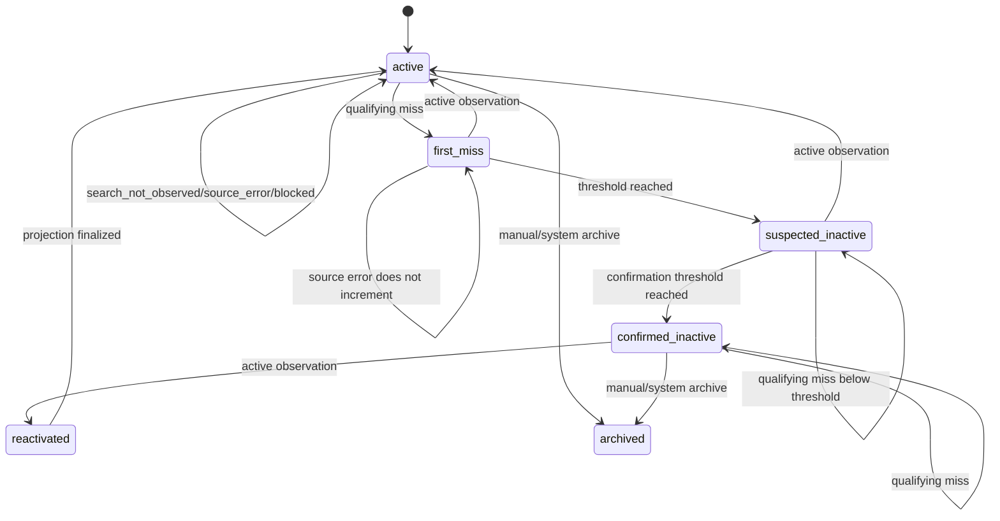

# 04. Event and Listing Lifecycle Engine

## 1. Purpose

Главная задача движка - различать:

- листинг активен;
- листинг не появился в конкретной поисковой выборке;
- листинг временно недоступен;
- источник не смог быть проверен;
- листинг предположительно неактивен;
- листинг подтверждённо не наблюдается по заданным правилам;
- листинг снова появился.

Система не должна превращать один пропуск в утверждение «удалён».

---

## 2. Two separate status concepts

### 2.1 Observation status

Что увидел конкретный run в конкретный момент.

```text
active
unavailable
not_found
search_not_observed
blocked
source_error
unknown
```

### 2.2 Lifecycle status

Накопленный вывод по истории.

```text
active
first_miss
suspected_inactive
confirmed_inactive
reactivated
archived
```

Observation status принадлежит snapshot.  
Lifecycle status принадлежит source listing current projection.

---

## 3. Meaning of observation statuses

### `active`

Direct observation confirms the listing/record is active or accessible.

### `unavailable`

The direct record exists, but is currently unavailable, paused or otherwise cannot be booked/viewed in a way that does not prove deletion.

### `not_found`

A direct identity check returns a high-confidence not-found result according to an approved adapter.

### `search_not_observed`

The listing was absent from a search result set.

This can happen because of:

- ranking;
- dates;
- availability;
- filters;
- pagination;
- personalization;
- coverage;
- search result cap;
- experiment;
- temporary source behavior.

It must never independently confirm inactivity.

### `blocked`

The collector was blocked, challenged or denied. This is not evidence about the listing.

### `source_error`

Technical failure, malformed response, timeout or provider outage. This is not a miss.

### `unknown`

Observation cannot be classified.

---

## 4. Default lifecycle state machine



---

## 5. Qualifying misses

Default:

| Observation | Increments consecutive misses? | Can confirm inactivity? |
|---|---:|---:|
| `active` | No, resets | No |
| `unavailable` | Configurable, default yes with low weight | Only with repeated direct evidence |
| `not_found` | Yes | Yes |
| `search_not_observed` | No | No |
| `blocked` | No | No |
| `source_error` | No | No |
| `unknown` | No | No |

Each source can override rules only through versioned configuration.

---

## 6. Default thresholds

Thresholds are configurable by dataset/source. Default MVP values:

### Active -> First miss

- one qualifying direct miss;
- run is not degraded;
- source compliance approved;
- adapter health is good enough;
- observation is comparable.

### First miss -> Suspected inactive

All required:

- at least 2 consecutive qualifying misses;
- observations occur in at least 2 distinct collection runs;
- at least 24 hours between first and latest miss;
- no active observation in between;
- no degraded-run suppression;
- confidence at least medium.

### Suspected inactive -> Confirmed inactive

All required:

- at least 3 consecutive qualifying misses;
- observations occur across at least 7 calendar days;
- at least one high-confidence direct `not_found`, or source-specific equivalent;
- no active observation in between;
- coverage quality acceptable;
- source error rate below threshold;
- confidence high.

### Confirmed inactive -> Reactivated

- one high-confidence active direct observation;
- or two medium-confidence active observations in separate runs.

UI label for `confirmed_inactive`:

> Likely inactive

Not:

> Removed by Airbnb

---

## 7. Degraded-run suppression

Mass disappearance can be a collector problem.

A run is degraded when any configured condition is true:

- valid observation count drops below 70% of comparable previous run;
- source error rate exceeds 15%;
- blocked rate exceeds 5%;
- region coverage unexpectedly collapses;
- parser version changes and compatibility is unknown;
- required fields disappear at abnormal rate;
- adapter health fails.

When a run is degraded:

- snapshots may be stored;
- source errors are visible;
- price/rating events may be suppressed if fields are unreliable;
- lifecycle misses do not increment by default;
- no mass suspected/confirmed inactivity;
- system owner must review or a healthy run must follow.

All thresholds are configuration, not hard-coded constants.

---

## 8. Confidence model

Confidence is explainable.

### High

Example:

- direct identity check;
- repeated across required time;
- healthy source run;
- stable parser;
- no conflicting active observation;
- evidence preserved.

### Medium

Example:

- repeated unavailable state;
- direct URL exists but activity unclear;
- one direct not-found plus corroborating observation;
- minor coverage concern.

### Low

Example:

- only search absence;
- approximate entity match;
- one observation;
- source or parser uncertainty.

Confidence explanation must be stored in `event_evidence.metadata`.

---

## 9. Event creation rules

## 9.1 Listing created

Generate when:

- source listing is first observed;
- current observation is valid;
- source listing did not already exist;
- event setting is enabled.

Deduplication key:

```text
listing_created:{source_listing_id}:{first_seen_date}:{rule_version}
```

## 9.2 First miss

Generate optionally for internal review.

```text
listing_first_miss:{source_listing_id}:{first_miss_snapshot_id}:{rule_version}
```

## 9.3 Suspected inactive

Generate on transition only.

```text
listing_suspected_inactive:{source_listing_id}:{transition_sequence}:{rule_version}
```

## 9.4 Confirmed inactive

Generate on transition only.

```text
listing_confirmed_inactive:{source_listing_id}:{transition_sequence}:{rule_version}
```

## 9.5 Reactivated

Generate when active observation follows confirmed or suspected inactive.

```text
listing_reactivated:{source_listing_id}:{active_snapshot_id}:{rule_version}
```

## 9.6 Field changes

Generate only if:

- both snapshots contain the field;
- parser compatibility allows comparison;
- change is material;
- event deduplication key is new.

---

## 10. Field materiality

## 10.1 Price

Store exact delta but default material event when:

- amount changes by at least 5%;
- or configured absolute amount;
- currency and unit are comparable.

Do not compare:

- different currencies without explicit conversion context;
- `night` with `stay`;
- price observed under materially different search parameters unless the observation context is equivalent.

Event text:

> Observed nightly price changed from IDR X to IDR Y under comparable observation conditions.

Not:

> The villa increased its revenue.

## 10.2 Rating

Material when:

- value changes by at least 0.05;
- or source precision changes and normalization rule confirms real change.

## 10.3 Review count

Any positive increase may be stored as diff.  
Generate visible event when:

- increase reaches configurable threshold;
- or report specifically requests all review growth.

Decrease is data quality warning unless source semantics explain it.

## 10.4 Title

Compare normalized title hash.

Ignore:

- whitespace only;
- Unicode normalization;
- punctuation-only changes if configured.

## 10.5 Description

Store hash diff. Do not store/display full third-party text unless permitted.

Event:

> Description content changed.

## 10.6 Photos

Compare authorized identifiers or stable fingerprints only.

Event:

> Photo set changed.

Do not copy image bytes from a third party unless licensed/owner-authorized.

## 10.7 Amenities

Normalize as sorted set.

Store:

- added;
- removed.

## 10.8 Host

Material when normalized host external ID changes.

Do not infer sale or management-company change without evidence.

## 10.9 Direct channels

Events:

- official website added/removed;
- business WhatsApp added/removed;
- direct booking URL added/removed.

These are valuable for Other Bali outreach but require source attribution.

---

## 11. Snapshot selection

`previous_snapshot` is not simply the immediately preceding row.

It must be the latest snapshot that is:

- for the same source listing;
- earlier than current;
- valid for the compared field;
- parser-compatible;
- not from a degraded run for that field;
- observation context compatible where required.

---

## 12. Field presence

Each snapshot stores `field_presence`.

Example:

```json
{
  "title": true,
  "rating": true,
  "review_count": true,
  "price": false,
  "bedrooms": true,
  "description_hash": false
}
```

Missing because not collected is different from collected null.

No event is generated when a field disappears solely because the current adapter did not collect it.

---

## 13. Rule versioning

Every diff and event stores `rule_version`.

Example:

```text
snapshot-normalizer:v1
field-diff:v1
lifecycle-state:v1
confidence:v1
```

Changing rules does not silently rewrite history.

Reprocessing creates:

- new derived events under a new rule version;
- or explicit migration with audit.

---

## 14. Idempotency

Running comparison twice must not duplicate:

- snapshots;
- diffs;
- events;
- lifecycle transitions;
- evidence.

Use unique constraints and deterministic keys.

---

## 15. Evidence requirements

Every event includes:

- event type;
- detection time;
- observation time;
- source;
- source listing;
- previous snapshot if applicable;
- current snapshot;
- run status;
- parser version;
- rule version;
- confidence;
- explanation;
- changed fields;
- raw evidence object reference where allowed.

Example explanation:

```text
The source listing returned a direct high-confidence not-found observation
in three healthy collection runs on 2026-08-02, 2026-08-05 and 2026-08-10.
No active observation occurred between those runs.
```

---

## 16. Manual review and corrections

Analyst can:

- dismiss event;
- mark reviewed;
- add note;
- flag source issue;
- request recheck;
- create lead.

System admin can:

- override lifecycle status;
- split/merge property;
- invalidate run;
- mark parser incompatible;
- reprocess derived events.

Manual action never edits immutable source snapshots.

---

## 17. Cause attribution

BAI may say:

- not observed;
- direct URL returned not found;
- likely inactive;
- reactivated;
- source error;
- coverage degraded.

BAI may not say without authoritative evidence:

- removed for missing documents;
- illegal villa;
- banned by Airbnb;
- owner failed tax obligations;
- permanently closed.

A separate authoritative government dataset could create a different event type with explicit source and legal review.

---

## 18. Pseudocode

```ts
async function processObservation(
  listing: SourceListing,
  snapshot: ListingSnapshot,
  context: RunContext
): Promise<LifecycleResult> {
  if (context.runIsDegraded) {
    return preserveStateWithEvidence(
      listing,
      snapshot,
      "Run degraded; lifecycle transition suppressed."
    );
  }

  if (
    snapshot.observationStatus === "source_error" ||
    snapshot.observationStatus === "blocked" ||
    snapshot.observationStatus === "unknown" ||
    snapshot.observationStatus === "search_not_observed"
  ) {
    return preserveStateWithEvidence(
      listing,
      snapshot,
      "Observation does not qualify as a lifecycle miss."
    );
  }

  if (snapshot.observationStatus === "active") {
    if (
      listing.currentLifecycleStatus === "suspected_inactive" ||
      listing.currentLifecycleStatus === "confirmed_inactive" ||
      listing.currentLifecycleStatus === "first_miss"
    ) {
      return reactivate(listing, snapshot);
    }

    return keepActiveAndResetMisses(listing, snapshot);
  }

  const misses = listing.consecutiveMisses + 1;

  if (qualifiesForConfirmedInactive(listing, snapshot, misses, context)) {
    return confirmInactive(listing, snapshot, misses);
  }

  if (qualifiesForSuspectedInactive(listing, snapshot, misses, context)) {
    return markSuspectedInactive(listing, snapshot, misses);
  }

  return markFirstMiss(listing, snapshot, misses);
}
```

---

## 19. Required test scenarios

1. Search absence alone never confirms inactivity.
2. Source error does not increment misses.
3. Blocked response does not increment misses.
4. One direct not-found creates first miss only.
5. Two qualifying misses across 24h create suspected inactive.
6. Three qualifying misses across 7 days create confirmed inactive.
7. Degraded run suppresses transition.
8. Active observation resets misses.
9. Active after confirmed creates reactivated.
10. Duplicate processing creates no duplicate event.
11. Parser mismatch suppresses unsafe field diffs.
12. Missing field due to coverage does not create removal event.
13. Price with different currency is not compared.
14. Property merge preserves source listing lifecycle.
15. Manual override is audited.
