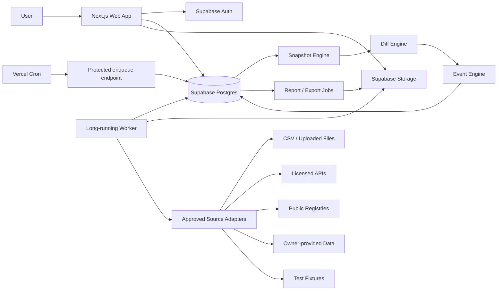
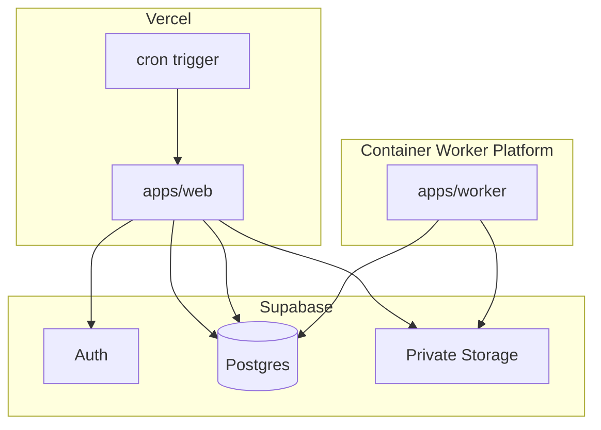
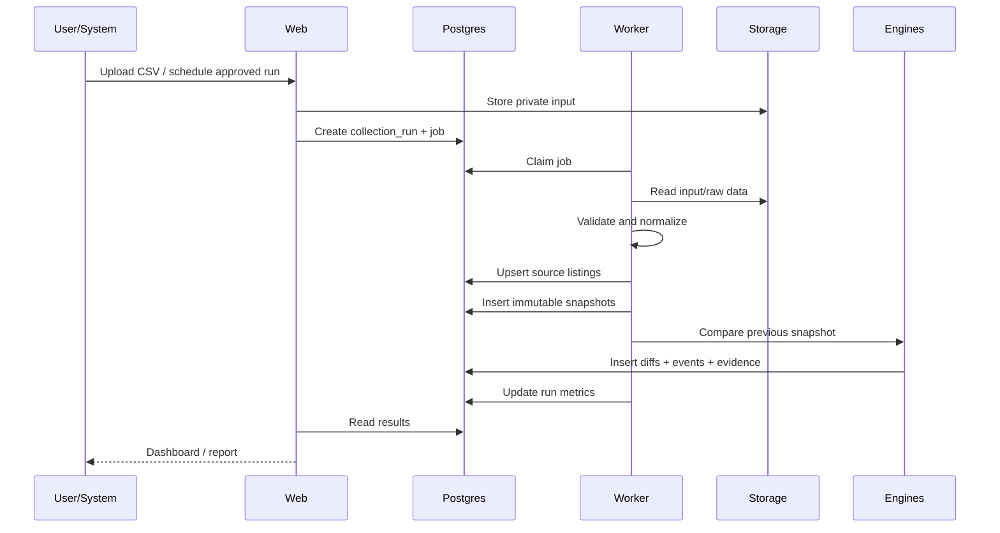
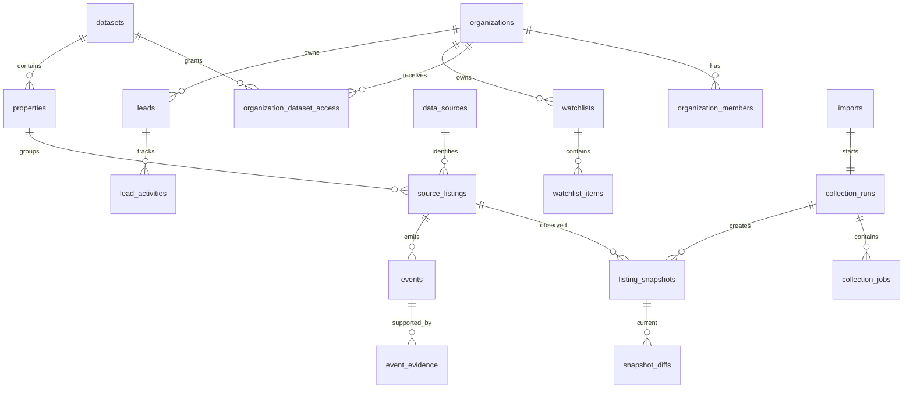
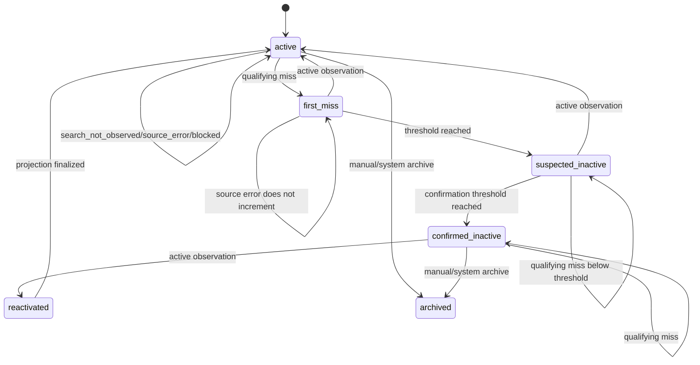

# BAI MASTER SPEC

Consolidated architecture and Codex implementation specification.


---

<!-- SOURCE FILE: 00_READ_ME_FIRST.md -->

# Bali Accommodation Intelligence
## Пакет архитектуры и технического задания для Codex

**Рабочее название:** Bali Accommodation Intelligence  
**Сокращение:** BAI  
**Версия документа:** 1.0  
**Дата фиксации:** 18 июля 2026  
**Язык интерфейса MVP:** английский  
**Часовой пояс отображения:** Asia/Makassar  
**Хранение времени в базе:** UTC

---

## 1. Что мы строим

BAI - это система исторической и событийной аналитики для рынка размещения Бали.

Она должна:

1. принимать повторные снимки данных из разрешённых источников;
2. нормализовать сведения о виллах и других объектах размещения;
3. хранить историю изменений;
4. сравнивать снимки;
5. находить новые, изменившиеся, временно недоступные и предположительно неактивные листинги;
6. показывать доказательства каждого вывода;
7. давать Other Bali, управляющим компаниям, аналитикам и инвесторам рабочий кабинет для поиска, фильтрации, watchlist, отчётов и лидов.

BAI не должен делать юридические выводы о том, является ли вилла незаконной или почему листинг перестал отображаться.

---

## 2. Главный архитектурный принцип

Система строится не вокруг Airbnb, а вокруг универсальной модели:

```text
Physical Property
    └── Source Listing
            └── Observation / Snapshot
                    └── Diff
                            └── Event
```

Один физический объект позднее сможет иметь листинги в разных источниках:

```text
Villa Serene
├── Airbnb listing
├── Booking.com property
├── Agoda property
├── Google place
├── Official website
└── Other Bali profile
```

Первый MVP должен работать без привязки к конкретному внешнему сайту. Данные загружаются через CSV, fixtures, owner-supplied data, licensed APIs и другие явно разрешённые каналы.

---

## 3. Что Codex должен сделать первым

Codex не должен начинать с live-коллектора.

Правильная последовательность:

1. создать монорепозиторий;
2. поднять веб-приложение и базу;
3. реализовать аутентификацию и организационную модель;
4. реализовать импорт CSV;
5. реализовать snapshot engine;
6. реализовать diff и event engine;
7. собрать основные экраны;
8. добавить worker и очередь задач;
9. добавить универсальный Source Adapter SDK;
10. проверить систему на fixtures;
11. только после отдельного разрешения подключать конкретный внешний источник.

---

## 4. Решения, которые уже приняты

| Область | Решение |
|---|---|
| Web framework | Next.js App Router, TypeScript |
| Runtime | Node.js 24 LTS |
| Package manager | pnpm |
| Monorepo | Turborepo |
| Database/Auth/Storage | Supabase |
| UI primitives | shadcn/ui |
| Styling | Tailwind CSS |
| Validation | Zod |
| Forms | React Hook Form + Zod |
| Worker | Отдельный long-running Node.js process |
| Scheduler | Vercel Cron только ставит задачи в очередь |
| Job queue MVP | PostgreSQL table queue с `FOR UPDATE SKIP LOCKED` |
| Geospatial | PostGIS |
| Map | MapLibre, tile provider configurable |
| Unit tests | Vitest |
| Browser/E2E tests | Playwright Test |
| Hosting web | Vercel |
| Hosting worker | Любая container platform с long-running process |
| Time storage | UTC |
| User display timezone | Asia/Makassar |
| Initial source | CSV / fixtures / approved data source |
| Unauthorized scraping | Запрещён и не входит в MVP |

---

## 5. Состав пакета

- `01_PRODUCT_AND_SITE_ARCHITECTURE.md` - продукт, роли, страницы, навигация и UX.
- `02_SYSTEM_ARCHITECTURE.md` - сервисы, монорепозиторий, инфраструктура и pipeline.
- `03_DATABASE_SCHEMA.md` - таблицы, поля, индексы и RLS.
- `04_EVENT_AND_REMOVAL_ENGINE.md` - правила сравнения и state machine.
- `05_CODEX_IMPLEMENTATION_PLAN.md` - этапы работы для Codex.
- `06_ACCEPTANCE_TESTS.md` - обязательные проверки.
- `07_SOURCE_COMPLIANCE.md` - правила допуска источников.
- `AGENTS.md` - постоянные инструкции Codex внутри репозитория.
- `fixtures/` - тестовые снимки для первого end-to-end сценария.
- `BAI_MASTER_SPEC.md` - единый объединённый документ.

---

## 6. Как запускать работу в Codex

1. Создать пустой Git-репозиторий.
2. Положить все файлы этого пакета в корень.
3. Открыть Codex в корне репозитория.
4. Дать ему команду:

```text
Read AGENTS.md and all BAI specification files.
Implement Milestone 0 only from 05_CODEX_IMPLEMENTATION_PLAN.md.
Do not start any later milestone.
Run every required verification command.
Return:
1. files changed;
2. commands run;
3. test results;
4. unresolved decisions;
5. exact next milestone.
```

5. После проверки каждого этапа запускать следующий milestone отдельно.

Не давать команду «сделай весь проект». Такая команда экономит одно предложение и создаёт неделю археологии.

---

## 7. Definition of Done для всего MVP

MVP считается готовым, когда:

- пользователь может войти;
- пользователь видит только данные доступной ему организации и dataset;
- можно импортировать baseline CSV;
- можно импортировать следующий снимок;
- импорт идемпотентен;
- создаются snapshots;
- создаются events;
- отсутствие в поисковой выдаче не называется удалением;
- source errors не считаются пропуском листинга;
- повторные подтверждённые наблюдения переводят листинг в `confirmed_inactive`;
- повторное появление создаёт `reactivated`;
- есть Overview, Properties, Property Detail, Events, Imports, Watchlists и Reports;
- можно экспортировать отфильтрованные данные;
- каждое событие содержит evidence;
- все чувствительные данные защищены;
- cron endpoint защищён секретом;
- live-автоматизация запрещённого источника отсутствует;
- lint, typecheck, unit tests, integration tests, E2E и production build проходят.

---

## 8. Что не следует менять без отдельного решения

- универсальную модель `Property -> Source Listing -> Snapshot -> Event`;
- distinction между `search_not_observed` и `not_found`;
- трёхступенчатое подтверждение неактивности;
- хранение evidence;
- compliance gate перед запуском адаптера;
- отдельный worker;
- multi-tenant модель;
- запрет на вывод «illegal» или «removed for non-compliance» без официальных данных;
- отсутствие платёжной системы в MVP.


---

<!-- SOURCE FILE: 01_PRODUCT_AND_SITE_ARCHITECTURE.md -->

# 01. Product and Site Architecture

## 1. Product definition

### 1.1 Рабочее название

**Bali Accommodation Intelligence (BAI)**

### 1.2 Продуктовая формулировка

BAI показывает, что изменилось на рынке размещения Бали, когда это произошло и на каких наблюдаемых данных основан вывод.

### 1.3 Основная боль

Люди, которые управляют, покупают или исследуют виллы, работают с разрозненными страницами, ручными таблицами и случайными снимками экрана. Они не видят историю рынка и не могут быстро ответить:

- какие объекты появились;
- какие перестали наблюдаться;
- какие изменили цену, рейтинг, контент или позиционирование;
- что происходит в конкретном районе;
- какие объекты стоит проверить вручную;
- кому может понадобиться дополнительный прямой канал продаж;
- какие данные подтверждают вывод.

### 1.4 Первая бизнес-ценность

Для Other Bali:

- построить рабочую карту рынка;
- находить новые партнёрские виллы;
- видеть объекты, которые могут искать альтернативные каналы;
- хранить историю, которую нельзя восстановить задним числом;
- готовить аргументированные предложения владельцам.

Для управляющих компаний:

- следить за конкурентным набором;
- видеть изменения рынка;
- сокращать ручной мониторинг;
- получать регулярные отчёты.

Для инвесторов и девелоперов:

- видеть динамику предложения;
- сравнивать районы;
- строить исследования на наблюдаемой истории, а не на рассказах продавца.

---

## 2. Product scope

### 2.1 MVP входит

1. Закрытый B2B dashboard.
2. Организации, роли и dataset access.
3. Импорт CSV.
4. Нормализация source listings.
5. Canonical properties.
6. Исторические snapshots.
7. Diff engine.
8. Event engine.
9. Listing lifecycle state machine.
10. Overview.
11. Properties table.
12. Property detail.
13. Map.
14. Events feed.
15. Imports and collection runs.
16. Watchlists.
17. Lead notes and stages.
18. Basic reports.
19. CSV export.
20. Data-source compliance registry.
21. Audit log.
22. Test fixtures.
23. English UI.
24. Asia/Makassar display timezone.

### 2.2 Не входит в MVP

- live Airbnb crawler;
- обход CAPTCHA, rate limits или anti-bot controls;
- загрузка и переиспользование чужих фотографий;
- копирование полного описания с внешней платформы без разрешения;
- автоматическое определение незаконности виллы;
- автоматическая массовая рассылка владельцам;
- booking engine;
- платежи;
- occupancy и revenue estimates без лицензированных данных;
- AI scoring, который нельзя объяснить;
- автоматическое объединение всех дублей между источниками;
- mobile app;
- публичный marketplace;
- полноценный API для внешних клиентов;
- billing.

---

## 3. User roles

### 3.1 System owner

Внутренняя роль команды BAI.

Может:

- управлять источниками;
- менять compliance status;
- видеть все datasets;
- создавать организации;
- видеть jobs и system logs;
- вручную объединять properties;
- исправлять parser mappings;
- управлять feature flags.

### 3.2 Organization owner

Владелец клиентской организации.

Может:

- видеть доступные datasets;
- приглашать пользователей;
- назначать роли;
- создавать watchlists;
- создавать reports;
- экспортировать данные;
- управлять настройками организации.

### 3.3 Admin

Почти те же права, кроме удаления организации и передачи ownership.

### 3.4 Analyst

Может:

- смотреть данные;
- работать с filters;
- создавать watchlists;
- делать notes;
- создавать reports и exports;
- менять lead stage.

Не может менять membership, source compliance и system settings.

### 3.5 Viewer

Только чтение и скачивание уже разрешённых reports.

---

## 4. Information architecture

Сайт состоит из двух зон:

```text
Public Website
└── Marketing, methodology, request access, login

Authenticated Application
└── Market intelligence dashboard
```

---

## 5. Public website routes

### 5.1 MVP routes

| Route | Назначение |
|---|---|
| `/` | Главная страница продукта |
| `/methodology` | Как собираются наблюдения и рассчитывается confidence |
| `/data-sources` | Какие типы источников допускаются |
| `/request-access` | Форма beta access |
| `/login` | Вход |
| `/legal/privacy` | Privacy policy |
| `/legal/terms` | Terms |
| `/legal/data-policy` | Политика данных и исправлений |

### 5.2 Routes после MVP

| Route | Назначение |
|---|---|
| `/product/market-watch` | Продукт для управляющих |
| `/product/lead-radar` | Продукт для партнёрских и sales-команд |
| `/product/reports` | Исследования и custom reports |
| `/solutions/property-managers` | Use case |
| `/solutions/investors` | Use case |
| `/solutions/developers` | Use case |
| `/pricing` | Тарифы после проверки модели |
| `/reports/[slug]` | Публичные отчёты, если разрешены |

---

## 6. Public homepage structure

### 6.1 Hero

**Headline:**

> See what changed in Bali accommodation before it becomes obvious.

**Supporting copy:**

> Track new listings, status changes, market movement and competitive sets using evidence-backed historical observations.

**Primary CTA:**

> Request beta access

**Secondary CTA:**

> View methodology

Не использовать:

- “real-time”, если данные не real-time;
- “all villas in Bali”, пока coverage не доказан;
- “removed by Airbnb”, если есть только отсутствие наблюдения;
- “illegal villas”;
- неподтверждённые показатели аудитории.

### 6.2 Product proof

Показать реальный mock/data example:

- 12,438 observed listings;
- 184 new since previous snapshot;
- 27 suspected inactive;
- 63 material changes;
- coverage date;
- confidence labels.

До появления реальных production numbers использовать демонстрационные данные с явной маркировкой `Demo dataset`.

### 6.3 Core modules

1. **Market Watch**  
   Changes in selected areas and comp sets.

2. **Listing Lifecycle**  
   Evidence-backed state changes instead of a simplistic removed/not removed label.

3. **Property History**  
   Timeline of snapshots and changes.

4. **Reports**  
   Exportable evidence for internal decisions.

### 6.4 Methodology and trust

Объяснить:

- data source access modes;
- observation dates;
- confidence;
- known limitations;
- correction process;
- no legal verdict.

### 6.5 Final CTA

> Build your Bali market watchlist.

---

## 7. Authenticated application routes

```text
/app
├── /overview
├── /properties
│   └── /[propertyId]
│       ├── overview
│       ├── listings
│       ├── history
│       ├── evidence
│       └── notes
├── /map
├── /events
├── /snapshots
├── /compare
├── /watchlists
│   └── /[watchlistId]
├── /leads
│   └── /[leadId]
├── /reports
│   └── /[reportId]
├── /imports
│   └── /[importId]
├── /data-sources
├── /jobs
└── /settings
    ├── /organization
    ├── /team
    ├── /notifications
    ├── /data-access
    └── /billing
```

`/billing` скрыт feature flag до появления коммерческого тарифа.

Internal routes:

```text
/admin
├── /datasets
├── /sources
├── /jobs
├── /parsers
├── /entity-resolution
├── /organizations
├── /audit
└── /feature-flags
```

---

## 8. App shell

### 8.1 Desktop

- left sidebar;
- organization switcher;
- dataset selector;
- global date range;
- global search;
- user menu;
- persistent content header;
- page-specific filter bar.

### 8.2 Mobile

MVP должен быть usable, но не обязан превращать плотную аналитику в карманный Bloomberg.

- sidebar становится Sheet;
- tables переходят в cards или horizontal scroll только внутри table container;
- critical actions доступны;
- map и complex compare рекомендуют desktop, но не ломаются;
- никаких горизонтальных scroll на всей странице.

### 8.3 Global search

Ищет по:

- property name;
- source listing title;
- external ID;
- source URL;
- area;
- host external ID;
- official website;
- business WhatsApp;
- tags.

Результаты группируются:

- Properties;
- Listings;
- Events;
- Leads.

---

## 9. Core screens

## 9.1 Overview

### Цель

За 30 секунд показать состояние dataset и последние изменения.

### Components

1. Coverage header:
   - dataset;
   - last successful run;
   - coverage window;
   - source status;
   - data freshness.

2. KPI cards:
   - active listings;
   - new listings;
   - suspected inactive;
   - confirmed inactive;
   - reactivated;
   - material changes.

3. Trend chart:
   - observed active listings by snapshot;
   - selectable region.

4. Area table:
   - region;
   - active;
   - new;
   - suspected inactive;
   - median observed price;
   - median rating;
   - coverage.

5. Event feed.

6. Watchlist alerts.

7. Import health:
   - last run;
   - rows accepted;
   - rejected;
   - source errors.

### Empty state

> Import a baseline snapshot to start building market history.

CTA:

> Import snapshot

---

## 9.2 Properties

### Цель

Рабочая таблица всех canonical properties.

### Columns

- property name;
- primary area;
- property type;
- bedrooms;
- source count;
- active listing count;
- last observed;
- lifecycle status;
- rating;
- review count;
- watchlist;
- lead stage;
- confidence.

### Filters

- dataset;
- region hierarchy;
- source;
- lifecycle status;
- observation status;
- rating range;
- review count range;
- bedroom range;
- property type;
- price range;
- direct website present;
- WhatsApp present;
- owner verified;
- last observed date;
- event type;
- confidence;
- watchlist;
- lead stage.

### Actions

- open property;
- add to watchlist;
- create lead;
- add note;
- compare;
- export selection.

### Pagination

Keyset/cursor pagination, not offset for large datasets.

---

## 9.3 Property detail

### Header

- canonical name;
- area;
- lifecycle badge;
- confidence;
- last observed;
- watchlist button;
- create/update lead;
- merge candidate action for system admin.

### Overview tab

- canonical facts;
- map point;
- source summary;
- latest normalized metrics;
- direct channels;
- tags;
- data quality warnings.

### Listings tab

Одна строка на source listing:

- source;
- external ID;
- URL;
- current observation status;
- lifecycle state;
- first seen;
- last seen;
- latest rating;
- latest reviews;
- latest observed price;
- evidence link.

### History tab

Timeline:

- first observed;
- price changes;
- rating/review changes;
- content changes;
- first miss;
- suspected inactive;
- confirmed inactive;
- reactivated;
- manual corrections.

### Evidence tab

Для каждого event:

- source;
- run ID;
- observed at;
- previous snapshot;
- current snapshot;
- changed fields;
- raw observation reference;
- parser version;
- confidence explanation.

### Notes tab

Organization-private notes with author and timestamps.

---

## 9.4 Map

### Layers

- active;
- new;
- suspected inactive;
- confirmed inactive;
- reactivated;
- watchlist;
- leads.

### Cluster behavior

- cluster at low zoom;
- count by lifecycle;
- click cluster zooms;
- click point opens property preview drawer.

### Filters

Повторяют основные filters Properties.

### Privacy

Точные координаты показываются только если источник и entitlement разрешают это. Иначе координаты округляются или показывается area centroid.

---

## 9.5 Events

### Event types

- listing_created;
- listing_suspected_inactive;
- listing_confirmed_inactive;
- listing_reactivated;
- price_changed;
- rating_changed;
- review_count_changed;
- title_changed;
- content_changed;
- amenities_changed;
- host_changed;
- source_error;
- manual_correction.

### Table columns

- event date;
- property;
- source listing;
- event;
- previous value;
- new value;
- confidence;
- region;
- evidence;
- reviewed status.

### Review action

Analyst может:

- mark reviewed;
- dismiss;
- add note;
- convert to lead;
- add to watchlist;
- correct false positive.

---

## 9.6 Snapshots

Показывает dataset-level snapshots:

- snapshot date;
- source;
- run;
- records;
- active;
- errors;
- rejected;
- new;
- changed;
- suspected;
- confirmed;
- duration;
- parser version.

Можно открыть summary и rejected rows.

---

## 9.7 Compare

Сравнивает два snapshots.

### Summary

- total previous;
- total current;
- intersection;
- only previous;
- only current;
- material changes;
- source errors;
- coverage delta.

### Tabs

- New;
- No longer observed;
- Changed;
- Unchanged;
- Errors.

Фраза `No longer observed` используется вместо `Removed`.

---

## 9.8 Watchlists

Watchlist содержит:

- properties;
- source listings;
- regions;
- saved filters.

Examples:

- Uluwatu high-rated villas;
- Other Bali priority outreach;
- Canggu comp set;
- suspected inactive;
- owner-verified partners.

Watchlist может иметь notification rule.

---

## 9.9 Leads

CRM-light, а не полноценный CRM.

### Lead fields

- property;
- contact name;
- role;
- business email;
- business WhatsApp;
- website;
- Instagram;
- source URL;
- lead stage;
- priority;
- reason;
- assigned user;
- last activity;
- next action;
- do-not-contact;
- notes.

### Lead stages

- new;
- research;
- ready_to_contact;
- contacted;
- replied;
- qualified;
- converted;
- not_relevant;
- do_not_contact.

### Restrictions

- никакой массовой рассылки в MVP;
- contact data только business/public/owner-provided;
- хранить source attribution;
- do-not-contact обязателен;
- исчезновение листинга не является доказательством проблемы.

---

## 9.10 Reports

MVP report types:

1. Snapshot summary.
2. Region change report.
3. Watchlist report.
4. Property history report.
5. Event evidence report.

Output:

- web preview;
- CSV;
- PDF generation can be v1.1;
- report metadata and immutable parameters.

---

## 9.11 Imports

Upload flow:

1. choose dataset;
2. choose source;
3. upload CSV;
4. map columns;
5. preview validation;
6. confirm import;
7. async processing;
8. view results;
9. download rejected rows.

Status:

- uploaded;
- validating;
- ready;
- processing;
- completed;
- completed_with_errors;
- failed;
- cancelled.

---

## 9.12 Data Sources

Visible information:

- source name;
- access mode;
- compliance status;
- automation allowed;
- last review;
- capabilities;
- last successful run;
- health;
- parser version.

Only system owner can change compliance status.

---

## 9.13 Jobs

Internal operational screen.

Columns:

- job ID;
- type;
- source;
- dataset;
- priority;
- status;
- attempts;
- scheduled for;
- started;
- finished;
- worker;
- error summary.

Actions:

- retry;
- cancel queued job;
- inspect logs.

---

## 10. Core user flows

## 10.1 First baseline import

```text
Login
→ Create/select organization
→ Select dataset
→ Upload baseline CSV
→ Map fields
→ Validate
→ Confirm
→ Background import
→ Properties and source listings created
→ First snapshots created
→ No change events generated except listing_created if configured
→ Overview becomes available
```

## 10.2 Second snapshot

```text
Upload follow-up CSV
→ Normalize
→ Match source listings
→ Create snapshots
→ Compare with previous valid snapshot
→ Generate diffs
→ Generate events
→ Update lifecycle state
→ Update Overview
```

## 10.3 Investigate a potentially inactive listing

```text
Event feed
→ Open suspected inactive event
→ Review evidence
→ Inspect observation history
→ Check source errors
→ Add to watchlist or lead
→ Mark reviewed
```

## 10.4 Correct a false match

```text
Property detail
→ Admin opens entity resolution
→ Split or merge source listing
→ Recompute affected canonical summary
→ Preserve audit trail
```

---

## 11. Design system

Existing Other Bali visual identity should inform the product:

- deep teal: `#005962`;
- warm ivory: `#FAF6EF`;
- coral accent: `#E08A5E`;
- dark brown: `#2B1A13`;
- body font: Hanken Grotesk when available;
- editorial headings: Young Serif when available.

### Application adaptation

- public site may use Young Serif for headlines;
- app UI uses Hanken Grotesk or Geist for clarity;
- metrics/IDs/timestamps may use Geist Mono;
- app background: warm neutral, not pure white;
- sidebar: deep teal;
- coral only for CTA/highlight, not every warning;
- status palette must remain accessible and not imply illegality.

### Status language

| Internal state | UI label |
|---|---|
| active | Active |
| first_miss | First miss |
| suspected_inactive | Suspected inactive |
| confirmed_inactive | Likely inactive |
| reactivated | Reactivated |
| search_not_observed | Not observed in search |
| source_error | Source error |

Do not show `Removed by Airbnb` unless there is authoritative evidence.

### Accessibility

- WCAG AA contrast;
- keyboard access;
- visible focus;
- semantic table and button elements;
- charts have textual summaries;
- status is not communicated only by color;
- every icon has accessible name or is decorative.

---

## 12. Analytics events

Track product usage, not guest PII.

```text
public_home_view
request_access_click
login_success
dataset_selected
overview_view
properties_filter_applied
property_opened
event_opened
event_marked_reviewed
watchlist_created
watchlist_item_added
lead_created
lead_stage_changed
import_started
import_validated
import_completed
import_failed
compare_run
report_created
export_started
export_completed
```

Each event includes:

- organization_id;
- user_id;
- dataset_id where applicable;
- timestamp;
- route;
- non-sensitive metadata.

---

## 13. Product copy rules

1. Use observation language.
2. Show dates.
3. Show confidence.
4. Show evidence.
5. Separate extracted facts from interpretation.
6. Never claim cause from correlation.
7. Never label a property illegal based on platform visibility.
8. Never imply complete market coverage without coverage evidence.
9. Use `observed price`, not `revenue`.
10. Use `likely inactive`, not `closed`.

---

## 14. MVP success metrics

Operational:

- at least 25,000 rows can be imported asynchronously;
- repeat import is idempotent;
- events are deterministic;
- no cross-organization data leakage;
- every event has evidence;
- source errors do not generate inactivity;
- manual correction is auditable.

Product:

- analyst can answer “what changed since the last snapshot?” in under two minutes;
- analyst can find all high-confidence likely inactive listings in a selected area;
- analyst can create a watchlist and export it;
- Other Bali team can create a lead from an evidence-backed event.


---

<!-- SOURCE FILE: 02_SYSTEM_ARCHITECTURE.md -->

# 02. System Architecture

## 1. Architecture goals

Система должна быть:

- source-agnostic;
- history-first;
- evidence-backed;
- multi-tenant;
- idempotent;
- observable;
- безопасной;
- пригодной для постепенного роста;
- независимой от одного OTA;
- способной пережить изменение HTML, API или бизнес-модели источника без переписывания ядра.

---

## 2. High-level architecture



---

## 3. Deployment architecture



### Important

Vercel Cron не выполняет тяжёлый collection job. Он только вызывает защищённый endpoint, который ставит due jobs в очередь.

Browser-based или долгие jobs, если когда-либо будут разрешены, исполняются только в отдельном worker container.

---

## 4. Monorepo

```text
bali-accommodation-intelligence/
├── apps/
│   ├── web/
│   │   ├── src/app/
│   │   ├── src/components/
│   │   ├── src/features/
│   │   ├── src/lib/
│   │   └── tests/
│   └── worker/
│       ├── src/jobs/
│       ├── src/runners/
│       ├── src/observability/
│       └── tests/
├── packages/
│   ├── db/
│   │   ├── src/clients/
│   │   ├── src/repositories/
│   │   ├── src/generated/
│   │   └── src/queries/
│   ├── domain/
│   │   ├── src/entities/
│   │   ├── src/enums/
│   │   ├── src/schemas/
│   │   └── src/errors/
│   ├── source-sdk/
│   │   ├── src/adapter.ts
│   │   ├── src/compliance.ts
│   │   ├── src/registry.ts
│   │   └── src/types.ts
│   ├── snapshot-engine/
│   ├── event-engine/
│   ├── import-engine/
│   ├── reporting/
│   ├── ui/
│   ├── config/
│   └── test-fixtures/
├── supabase/
│   ├── migrations/
│   ├── seed.sql
│   ├── config.toml
│   └── tests/
├── docs/
├── scripts/
├── .github/workflows/
├── AGENTS.md
├── package.json
├── pnpm-workspace.yaml
├── turbo.json
├── tsconfig.base.json
├── .env.example
└── README.md
```

---

## 5. Technology stack

### 5.1 Web

- Next.js App Router;
- React;
- TypeScript strict mode;
- Tailwind CSS;
- shadcn/ui;
- Zod;
- React Hook Form;
- TanStack Table only if shadcn table composition becomes insufficient;
- MapLibre GL JS;
- date-fns or Temporal-compatible utility;
- server components by default;
- client components only for interactive filters, map, charts and forms.

### 5.2 Runtime

- Node.js 24 LTS;
- pnpm;
- pinned dependency versions;
- committed lockfile;
- no unpinned `latest` in committed package.json.

### 5.3 Data

- Supabase Postgres;
- Supabase Auth;
- Supabase Storage;
- PostGIS;
- SQL migrations;
- generated TypeScript database types;
- RLS for every exposed table;
- private schema for credentials, jobs, raw observations and operational internals.

### 5.4 Testing

- Vitest for unit tests;
- database integration tests against local Supabase;
- Playwright Test for E2E;
- fixture-based adapter tests;
- snapshot/event golden tests;
- accessibility smoke tests.

### 5.5 Observability

MVP:

- structured JSON logs;
- collection run metrics;
- job attempts and errors;
- request ID;
- run ID;
- source key;
- parser version;
- audit logs;
- health endpoints.

Optional after MVP:

- Sentry;
- OpenTelemetry;
- centralized log drain.

---

## 6. Application boundaries

## 6.1 `apps/web`

Responsibilities:

- public website;
- auth;
- dashboard rendering;
- organization and dataset authorization;
- Server Actions for in-app mutations;
- Route Handlers for uploads, exports, webhooks and cron;
- report previews;
- signed URLs;
- UI analytics events.

Must not:

- run long collection jobs;
- contain source credentials;
- expose service role to browser;
- parse very large files synchronously;
- make legal conclusions.

## 6.2 `apps/worker`

Responsibilities:

- poll job queue;
- acquire jobs safely;
- run imports;
- run approved adapters;
- normalize observations;
- create snapshots;
- compare snapshots;
- generate events;
- generate exports/reports;
- record logs and metrics;
- retry transient failures.

Must:

- use bounded concurrency;
- heartbeat running jobs;
- release stale jobs;
- enforce source compliance gate;
- be idempotent;
- handle shutdown gracefully;
- never log secrets.

## 6.3 `packages/domain`

Pure domain types and validation:

- enums;
- entity interfaces;
- Zod schemas;
- business errors;
- lifecycle transitions;
- event types;
- money representation;
- timestamps;
- confidence model.

No database or network imports.

## 6.4 `packages/db`

Responsibilities:

- lazy clients;
- generated database types;
- repositories;
- transaction helpers;
- keyset pagination;
- authorization-aware queries;
- job claim/release methods.

No UI.

## 6.5 `packages/source-sdk`

Responsibilities:

- adapter contract;
- compliance gate;
- source registry;
- capability declaration;
- raw observation contract;
- normalized observation contract;
- health checks;
- rate-limit metadata;
- fixture adapter.

No source-specific logic in core packages.

## 6.6 `packages/import-engine`

Responsibilities:

- file validation;
- header mapping;
- row parsing;
- rejected rows;
- deduplication;
- normalized observation creation;
- progress metrics;
- import idempotency.

## 6.7 `packages/snapshot-engine`

Responsibilities:

- select previous comparable snapshot;
- create immutable snapshot;
- calculate fingerprints;
- store raw evidence reference;
- update first_seen/last_seen;
- avoid duplicate snapshot insertion.

## 6.8 `packages/event-engine`

Responsibilities:

- field diff;
- materiality;
- lifecycle state machine;
- confidence;
- evidence;
- event idempotency;
- reactivation.

## 6.9 `packages/reporting`

Responsibilities:

- report definitions;
- immutable parameters;
- async CSV export;
- future PDF rendering;
- signed download URLs.

---

## 7. Source adapter contract

```ts
export type SourceCapability =
  | "listing_identity"
  | "listing_status"
  | "search_presence"
  | "title"
  | "rating"
  | "review_count"
  | "price"
  | "location"
  | "host_identity"
  | "direct_channels"
  | "amenities"
  | "content_fingerprint";

export type SourceComplianceStatus =
  | "approved"
  | "restricted"
  | "pending_review"
  | "disabled";

export interface SourceAdapterDefinition {
  key: string;
  displayName: string;
  accessMode:
    | "owner_supplied"
    | "licensed_api"
    | "public_registry"
    | "manual_import"
    | "browser_automation"
    | "demo_fixture";
  complianceStatus: SourceComplianceStatus;
  automationAllowed: boolean;
  capabilities: SourceCapability[];
  parserVersion: string;
}

export interface CollectionPlan {
  sourceKey: string;
  datasetId: string;
  regionIds?: string[];
  externalIds?: string[];
  requestedAt: string;
  requestedBy: string;
  configuration: Record<string, unknown>;
}

export interface RawObservation {
  sourceKey: string;
  externalId: string;
  observedAt: string;
  observationStatus:
    | "active"
    | "unavailable"
    | "not_found"
    | "search_not_observed"
    | "blocked"
    | "source_error"
    | "unknown";
  sourceUrl?: string;
  payload: unknown;
  evidence: {
    method: string;
    requestId?: string;
    objectPath?: string;
    notes?: string;
  };
}

export interface NormalizedListingObservation {
  sourceKey: string;
  externalId: string;
  sourceUrl?: string;
  observedAt: string;
  observationStatus: RawObservation["observationStatus"];

  title?: string;
  propertyType?: string;
  regionName?: string;
  latitude?: number;
  longitude?: number;

  rating?: number;
  reviewCount?: number;
  observedPrice?: {
    amount: string;
    currency: string;
    unit: "night" | "stay" | "unknown";
  };

  bedrooms?: number;
  bathrooms?: number;
  guestCapacity?: number;

  isSuperhost?: boolean;
  hostExternalId?: string;

  officialWebsite?: string;
  businessWhatsapp?: string;
  directBookingUrl?: string;

  titleHash?: string;
  descriptionHash?: string;
  photosHash?: string;
  amenitiesHash?: string;
  contentFingerprint: string;

  parserVersion: string;
  rawEvidenceObjectPath?: string;
}

export interface SourceAdapter {
  definition: SourceAdapterDefinition;

  validateConfiguration(
    config: Record<string, unknown>
  ): Promise<void>;

  healthCheck(): Promise<{
    ok: boolean;
    checkedAt: string;
    message?: string;
  }>;

  collect(
    plan: CollectionPlan,
    signal: AbortSignal
  ): AsyncIterable<RawObservation>;

  normalize(
    observation: RawObservation
  ): Promise<NormalizedListingObservation>;
}
```

### Required gate

До вызова `collect` worker обязан выполнить:

```ts
assertSourceExecutionAllowed(definition)
```

Функция бросает ошибку, если:

- compliance status не `approved`;
- automationAllowed = false для автоматического job;
- source review просрочен;
- requested capability не разрешена;
- required agreement/config отсутствует.

---

## 8. Data ingestion pipeline



### Detailed steps

1. Create `collection_run`.
2. Create one or more `collection_jobs`.
3. Claim job.
4. Verify source compliance.
5. Read input.
6. Validate schema.
7. Parse each row.
8. Reject invalid rows with reason.
9. Normalize.
10. Resolve source listing by `(source_id, external_id)`.
11. Resolve or create canonical property.
12. Insert immutable snapshot.
13. Find previous valid comparable snapshot.
14. Calculate field-level diff.
15. Evaluate lifecycle transition.
16. Insert events and evidence.
17. Update derived current state.
18. Update run counters.
19. Mark job and run complete.
20. Notify UI/report pipeline.

---

## 9. Job queue architecture

MVP uses Postgres, not Redis.

### 9.1 Why

- fewer moving parts;
- transactional creation of jobs;
- enough for MVP volume;
- easy auditability;
- one source of truth.

### 9.2 Claim query pattern

Worker must claim jobs atomically using a transaction and `FOR UPDATE SKIP LOCKED`.

Conceptual SQL:

```sql
with next_job as (
  select id
  from private.collection_jobs
  where status = 'queued'
    and scheduled_for <= now()
  order by priority desc, scheduled_for asc, created_at asc
  for update skip locked
  limit 1
)
update private.collection_jobs j
set
  status = 'running',
  locked_at = now(),
  locked_by = :worker_id,
  started_at = coalesce(started_at, now()),
  attempts = attempts + 1
from next_job
where j.id = next_job.id
returning j.*;
```

### 9.3 Heartbeat

Running worker updates:

- `heartbeat_at`;
- progress current;
- progress total;
- current stage.

### 9.4 Stale job recovery

A periodic maintenance job returns stale running jobs to `retry_wait` when:

- heartbeat older than timeout;
- attempt count below max attempts;
- job is retryable.

Permanent errors become `failed`.

### 9.5 Retry policy

Default:

- max attempts: 3;
- exponential delay;
- transient network/source errors retry;
- validation and compliance errors do not retry automatically;
- idempotency key prevents duplicate effects.

### 9.6 Scale threshold

Evaluate a dedicated queue when any is true:

- over 100,000 jobs/day;
- frequent lock contention;
- delayed jobs exceed acceptable lag;
- long-running workflows require fan-out;
- independent priority queues are needed.

---

## 10. Snapshot architecture

Snapshots are immutable observations.

### 10.1 Snapshot layers

1. Raw evidence in private Storage.
2. Normalized snapshot in Postgres.
3. Current-state projection on source listing.
4. Canonical property summary.
5. Events derived from snapshot comparison.

### 10.2 Fingerprints

Use deterministic hashes for large or noisy fields:

- `title_hash`;
- `description_hash`;
- `photos_hash`;
- `amenities_hash`;
- `content_fingerprint`.

Normalization before hashing:

- Unicode normalize;
- trim;
- collapse whitespace;
- lower-case where case is not meaningful;
- sort sets such as amenities/photo identifiers;
- remove volatile tracking query strings;
- do not hash timestamps or session-specific data.

### 10.3 Comparable snapshots

A snapshot is comparable only when:

- same source listing;
- parser versions are compatible, or migration rule exists;
- status is not source_error/blocked unless comparing status itself;
- source coverage mode is equivalent;
- required fields were actually observed.

---

## 11. Canonical property resolution

### 11.1 MVP

- exact source listing identity;
- one source listing initially maps to one canonical property;
- manual merge/split;
- import may include explicit `canonical_property_key`;
- no opaque AI auto-merge.

### 11.2 Candidate matching

System may suggest candidates using:

- normalized name;
- distance;
- official website domain;
- phone/WhatsApp;
- source IDs;
- bedroom count;
- image fingerprints where legally permitted.

Suggestion must include reasons and score.

### 11.3 Merge rules

Merge:

- retains all source listings;
- creates audit event;
- redirects old property IDs;
- recomputes current summary;
- does not delete snapshots.

Split:

- moves selected source listings;
- keeps evidence and history;
- records actor and reason.

---

## 12. Web rendering strategy

### Server Components

Use for:

- overview data;
- property tables;
- property header;
- reports list;
- imports list;
- auth-protected layouts.

### Client Components

Use for:

- map;
- interactive charts;
- complex filter builder;
- table column controls;
- upload mapping wizard;
- dialogs;
- optimistic watchlist actions.

### Server Actions

Use for:

- create/update watchlist;
- add note;
- mark event reviewed;
- change lead stage;
- update settings.

### Route Handlers

Use for:

- cron endpoint;
- upload initiation;
- import confirmation;
- webhooks;
- large exports;
- signed downloads;
- health checks;
- future external API.

### Caching

- never share user-private cached responses across organizations;
- use request-scoped or private caching for org-specific data;
- cache public methodology pages;
- invalidate summaries after completed run;
- do not cache rapidly changing job status for long periods.

---

## 13. API design

### 13.1 Internal HTTP endpoints

```text
GET    /api/health
GET    /api/ready

POST   /api/imports/presign
POST   /api/imports
GET    /api/imports/:id
POST   /api/imports/:id/cancel
GET    /api/imports/:id/rejections

POST   /api/exports
GET    /api/exports/:id
GET    /api/exports/:id/download

POST   /api/reports
GET    /api/reports/:id

GET    /api/search

GET    /api/cron/enqueue-due-jobs
POST   /api/webhooks/:provider
```

Most dashboard CRUD uses Server Actions rather than duplicating an internal REST API.

### 13.2 Future public API

Not in MVP, but namespace is reserved:

```text
/api/v1/properties
/api/v1/source-listings
/api/v1/events
/api/v1/reports
```

Future API requirements:

- API keys;
- organization entitlements;
- rate limits;
- cursor pagination;
- versioning;
- OpenAPI;
- audit.

---

## 14. File uploads and storage

### Buckets

| Bucket | Visibility | Content |
|---|---|---|
| `import-files` | private | uploaded CSV |
| `raw-observations` | private | raw evidence |
| `report-files` | private | exports/reports |
| `owner-assets` | private by default | owner-authorized media |
| `public-assets` | public | product-owned marketing assets |

### Rules

- signed upload/download URLs;
- MIME and size validation;
- virus scanning can be added later;
- file names are not trusted;
- use generated object keys;
- retention policy by bucket;
- no third-party copyrighted photo rehosting without permission.

---

## 15. Security architecture

### 15.1 Authentication

- Supabase Auth;
- email magic link or email/password for MVP;
- MFA later;
- session handled server-side;
- protected app layout;
- revalidate authorization on sensitive mutations.

### 15.2 Authorization

- organization memberships;
- dataset access;
- role capabilities;
- server-side checks;
- RLS on exposed tables;
- no authorization from user-editable metadata.

### 15.3 Secrets

- never expose service role;
- frontend uses publishable key only;
- worker secrets are server environment variables;
- source credentials never enter browser;
- `.env.example` contains names only;
- logs redact headers, tokens and personal data.

### 15.4 Database

- public tables have RLS;
- private schema is not exposed;
- explicit grants;
- security-invoker views;
- indexes on RLS predicates;
- no public SECURITY DEFINER functions;
- audit all privileged operations.

### 15.5 Cron

`GET /api/cron/enqueue-due-jobs` validates:

```text
Authorization: Bearer ${CRON_SECRET}
```

Unauthorized returns 401.

### 15.6 Rate limiting

MVP:

- login handled by Auth provider;
- upload endpoints rate-limited per org/user;
- search endpoint rate-limited;
- public request-access rate-limited and spam-protected;
- future public API has separate quotas.

---

## 16. Data quality architecture

Every record should expose:

- source;
- observed_at;
- parser_version;
- observation_status;
- confidence;
- last_successful_run;
- coverage context;
- evidence.

### Data quality flags

```text
missing_external_id
invalid_url
invalid_coordinates
coordinates_outside_bali
rating_out_of_range
negative_review_count
unknown_currency
duplicate_row
parser_version_mismatch
coverage_drop
source_error_spike
unusually_large_change
entity_resolution_conflict
```

Runs with severe coverage drop should not generate mass inactivity events automatically.

Example guard:

```text
If current valid observations < 70% of previous run
AND source reports elevated errors,
mark run as degraded and suppress inactivity transitions.
```

Threshold must be configurable per source/dataset.

---

## 17. Performance targets

MVP target dataset:

- 25,000 source listings;
- weekly snapshots;
- 1,300,000 normalized snapshots after one year;
- up to 100 users;
- up to 20 organizations.

Targets:

- property list query p95 below 750 ms at database layer with filters;
- overview query p95 below 1.5 s;
- 25,000-row CSV import completes asynchronously within 10 minutes under normal worker capacity;
- UI remains responsive while jobs run;
- export is asynchronous above 10,000 rows;
- no N+1 queries on table pages;
- cursor pagination;
- materialized summaries for expensive overview analytics when needed.

These are engineering targets, not public claims.

---

## 18. Reliability

### Idempotency

Required keys:

- import file checksum;
- collection run idempotency key;
- source listing unique key;
- snapshot fingerprint;
- event deduplication key;
- export request hash.

### Transactions

Use transactions for:

- job claim;
- source listing + snapshot association;
- lifecycle state update + event insert;
- property merge/split;
- membership changes.

### Partial failure

One invalid row must not fail a whole import unless configured threshold exceeded.

Import result includes:

- accepted;
- rejected;
- duplicates;
- created;
- updated;
- unchanged;
- events;
- warnings.

---

## 19. Scheduler

MVP schedule:

- daily enqueue check at 00:15 UTC;
- stale job recovery every 15 minutes, if plan allows;
- weekly maintenance;
- reports scheduled per organization later.

`vercel.json` example:

```json
{
  "crons": [
    {
      "path": "/api/cron/enqueue-due-jobs",
      "schedule": "15 0 * * *"
    }
  ]
}
```

Do not rely on Vercel Cron for exact execution time. Job due time lives in database.

---

## 20. Environment variables

```text
NEXT_PUBLIC_SUPABASE_URL=
NEXT_PUBLIC_SUPABASE_PUBLISHABLE_KEY=

SUPABASE_SERVICE_ROLE_KEY=
SUPABASE_DB_URL=

CRON_SECRET=
WORKER_ID=
WORKER_POLL_INTERVAL_MS=
WORKER_CONCURRENCY=

APP_URL=
APP_TIMEZONE=Asia/Makassar

MAP_STYLE_URL=
MAP_TILE_API_KEY=

ANALYTICS_PROVIDER=
SENTRY_DSN=
```

Rules:

- server-only variables never begin with `NEXT_PUBLIC_`;
- fail fast at runtime with Zod env validation;
- database/service clients are lazy initialized;
- test environment uses separate project/local stack.

---

## 21. CI pipeline

On pull request:

1. install pinned dependencies;
2. lint;
3. typecheck;
4. unit tests;
5. database schema tests;
6. build;
7. selected E2E smoke tests;
8. dependency audit;
9. verify generated database types are current.

On main:

- repeat all checks;
- deploy preview/production according to branch policy;
- apply migrations through controlled workflow;
- run smoke test;
- do not auto-enable a source adapter.

---

## 22. Architecture decision records

Create `docs/adr/`.

Required ADRs:

```text
0001-source-agnostic-domain-model.md
0002-postgres-job-queue-for-mvp.md
0003-separate-long-running-worker.md
0004-evidence-backed-lifecycle-state.md
0005-dataset-based-multi-tenancy.md
0006-no-unauthorized-live-scraping.md
0007-immutable-snapshots.md
0008-manual-entity-resolution-first.md
```

Each ADR contains:

- context;
- decision;
- consequences;
- alternatives;
- date;
- status.


---

<!-- SOURCE FILE: 03_DATABASE_SCHEMA.md -->

# 03. Database Schema

## 1. Database conventions

- PostgreSQL through Supabase.
- UUID primary keys.
- `timestamptz` for all timestamps.
- UTC storage.
- `created_at` and `updated_at` where mutable.
- Immutable snapshots and events.
- `snake_case`.
- Money stored as `numeric`, never float.
- Currency stored as ISO 4217 `char(3)` where known.
- Coordinates use PostGIS geography.
- User-facing tables in `public`.
- Operational secrets/raw payloads in `private`.
- Analytics views in `analytics`.
- RLS on every exposed table.
- Explicit grants for Data API access.
- Soft deletion only where history matters.
- No guest personal data.

---

## 2. Extensions

Required:

```sql
create extension if not exists pgcrypto;
create extension if not exists postgis;
create extension if not exists citext;
```

Optional later:

```sql
create extension if not exists pg_trgm;
```

---

## 3. Enums

Create enums in a dedicated `app` schema or use check constraints if migration portability is preferred.

```text
member_role:
  owner
  admin
  analyst
  viewer

dataset_status:
  active
  paused
  archived

source_access_mode:
  owner_supplied
  licensed_api
  public_registry
  manual_import
  browser_automation
  demo_fixture

source_compliance_status:
  approved
  restricted
  pending_review
  disabled

observation_status:
  active
  unavailable
  not_found
  search_not_observed
  blocked
  source_error
  unknown

listing_lifecycle_status:
  active
  first_miss
  suspected_inactive
  confirmed_inactive
  reactivated
  archived

confidence_level:
  low
  medium
  high

collection_run_status:
  pending
  queued
  running
  completed
  completed_with_errors
  degraded
  failed
  cancelled

job_status:
  queued
  running
  retry_wait
  succeeded
  failed
  cancelled

job_type:
  import
  collect
  normalize
  compare
  report
  export
  notify
  maintenance

event_type:
  listing_created
  listing_first_miss
  listing_suspected_inactive
  listing_confirmed_inactive
  listing_reactivated
  listing_archived
  price_changed
  rating_changed
  review_count_changed
  title_changed
  description_changed
  photos_changed
  amenities_changed
  host_changed
  superhost_gained
  superhost_lost
  location_changed
  direct_channel_added
  direct_channel_removed
  source_error
  manual_correction
  property_merged
  property_split

lead_stage:
  new
  research
  ready_to_contact
  contacted
  replied
  qualified
  converted
  not_relevant
  do_not_contact

import_status:
  uploaded
  validating
  ready
  processing
  completed
  completed_with_errors
  failed
  cancelled

report_status:
  queued
  generating
  ready
  failed
  expired
```

---

## 4. Schema map



---

## 5. Identity and tenancy tables

## 5.1 `public.profiles`

One row per Supabase Auth user.

| Field | Type | Rules |
|---|---|---|
| `id` | uuid | PK, references `auth.users(id)` |
| `full_name` | text | nullable |
| `avatar_url` | text | nullable |
| `timezone` | text | default `Asia/Makassar` |
| `created_at` | timestamptz | default now |
| `updated_at` | timestamptz | default now |

RLS:

- user can read/update own profile;
- system owner may read all through server-only admin path.

## 5.2 `public.organizations`

| Field | Type | Rules |
|---|---|---|
| `id` | uuid | PK |
| `name` | text | required |
| `slug` | citext | unique |
| `status` | text | active/suspended/archived |
| `plan_code` | text | default `internal_beta` |
| `default_timezone` | text | default `Asia/Makassar` |
| `created_at` | timestamptz | default now |
| `updated_at` | timestamptz | default now |

## 5.3 `public.organization_members`

| Field | Type | Rules |
|---|---|---|
| `organization_id` | uuid | FK organizations |
| `user_id` | uuid | FK auth.users |
| `role` | member_role | required |
| `invited_by` | uuid | nullable |
| `created_at` | timestamptz | default now |

Primary key:

```text
(organization_id, user_id)
```

Indexes:

- `(user_id, organization_id)`;
- `(organization_id, role)`.

## 5.4 `public.datasets`

Dataset is a shareable collection of market observations.

| Field | Type | Rules |
|---|---|---|
| `id` | uuid | PK |
| `name` | text | required |
| `slug` | citext | unique |
| `description` | text | nullable |
| `status` | dataset_status | required |
| `owner_organization_id` | uuid | nullable |
| `coverage_country_code` | char(2) | default `ID` |
| `coverage_region` | text | default `Bali` |
| `default_timezone` | text | default `Asia/Makassar` |
| `created_at` | timestamptz | default now |
| `updated_at` | timestamptz | default now |

## 5.5 `public.organization_dataset_access`

| Field | Type | Rules |
|---|---|---|
| `organization_id` | uuid | FK |
| `dataset_id` | uuid | FK |
| `access_level` | text | read/manage |
| `created_at` | timestamptz | default now |

Primary key:

```text
(organization_id, dataset_id)
```

---

## 6. Geographic tables

## 6.1 `public.regions`

Hierarchical Bali geography.

| Field | Type | Rules |
|---|---|---|
| `id` | uuid | PK |
| `parent_id` | uuid | self FK nullable |
| `name` | text | required |
| `slug` | citext | required |
| `region_type` | text | province/regency/district/village/area |
| `country_code` | char(2) | default ID |
| `geometry` | geography(MultiPolygon,4326) | nullable |
| `centroid` | geography(Point,4326) | nullable |
| `created_at` | timestamptz | default now |

Unique:

```text
(parent_id, slug)
```

Indexes:

- GiST `geometry`;
- GiST `centroid`;
- `(parent_id, region_type)`.

---

## 7. Source registry

## 7.1 `private.data_sources`

| Field | Type | Rules |
|---|---|---|
| `id` | uuid | PK |
| `key` | citext | unique |
| `display_name` | text | required |
| `access_mode` | source_access_mode | required |
| `compliance_status` | source_compliance_status | required |
| `automation_allowed` | boolean | default false |
| `capabilities` | text[] | required |
| `terms_reviewed_at` | timestamptz | nullable |
| `review_expires_at` | timestamptz | nullable |
| `reviewed_by` | uuid | nullable |
| `restriction_reason` | text | nullable |
| `configuration_schema` | jsonb | nullable |
| `rate_limit_policy` | jsonb | nullable |
| `created_at` | timestamptz | default now |
| `updated_at` | timestamptz | default now |

No Data API grant.

## 7.2 `private.parser_versions`

| Field | Type |
|---|---|
| `id` | uuid PK |
| `source_id` | uuid FK |
| `version` | text |
| `schema_version` | integer |
| `compatible_with_previous` | boolean |
| `released_at` | timestamptz |
| `notes` | text |
| `is_active` | boolean |

Unique:

```text
(source_id, version)
```

---

## 8. Property and listing tables

## 8.1 `public.properties`

Canonical physical accommodation.

| Field | Type | Rules |
|---|---|---|
| `id` | uuid | PK |
| `dataset_id` | uuid | required FK |
| `canonical_name` | text | required |
| `slug` | citext | nullable |
| `property_type` | text | nullable |
| `primary_region_id` | uuid | nullable |
| `location` | geography(Point,4326) | nullable |
| `coordinate_precision_meters` | integer | nullable |
| `bedrooms` | numeric(4,1) | nullable |
| `bathrooms` | numeric(4,1) | nullable |
| `guest_capacity` | integer | nullable |
| `official_website` | text | nullable |
| `business_whatsapp` | text | nullable |
| `direct_booking_url` | text | nullable |
| `owner_verified` | boolean | default false |
| `verification_source` | text | nullable |
| `current_lifecycle_status` | listing_lifecycle_status | nullable |
| `current_confidence` | confidence_level | nullable |
| `first_observed_at` | timestamptz | nullable |
| `last_observed_at` | timestamptz | nullable |
| `created_at` | timestamptz | default now |
| `updated_at` | timestamptz | default now |
| `archived_at` | timestamptz | nullable |

Unique:

```text
(dataset_id, slug) where slug is not null
```

Indexes:

- `(dataset_id, current_lifecycle_status)`;
- `(dataset_id, primary_region_id)`;
- `(dataset_id, last_observed_at desc)`;
- GiST `location`;
- trigram index on canonical_name later.

## 8.2 `public.property_aliases`

| Field | Type |
|---|---|
| `id` | uuid PK |
| `property_id` | uuid FK |
| `alias` | text |
| `source` | text |
| `created_at` | timestamptz |

Unique:

```text
(property_id, lower(alias))
```

## 8.3 `public.source_listings`

A channel-specific listing or record.

| Field | Type | Rules |
|---|---|---|
| `id` | uuid | PK |
| `dataset_id` | uuid | required |
| `property_id` | uuid | required |
| `source_id` | uuid | required |
| `external_id` | text | required |
| `source_url` | text | nullable |
| `current_title` | text | nullable |
| `current_observation_status` | observation_status | nullable |
| `current_lifecycle_status` | listing_lifecycle_status | default active |
| `current_confidence` | confidence_level | default low |
| `first_seen_at` | timestamptz | required |
| `last_seen_active_at` | timestamptz | nullable |
| `last_observed_at` | timestamptz | required |
| `consecutive_misses` | integer | default 0 |
| `first_miss_at` | timestamptz | nullable |
| `suspected_inactive_at` | timestamptz | nullable |
| `confirmed_inactive_at` | timestamptz | nullable |
| `reactivated_at` | timestamptz | nullable |
| `latest_snapshot_id` | uuid | nullable, FK added after snapshot table |
| `host_external_id` | text | nullable |
| `official_website` | text | nullable |
| `business_whatsapp` | text | nullable |
| `direct_booking_url` | text | nullable |
| `created_at` | timestamptz | default now |
| `updated_at` | timestamptz | default now |
| `archived_at` | timestamptz | nullable |

Unique:

```text
(dataset_id, source_id, external_id)
```

Indexes:

- `(dataset_id, source_id, current_lifecycle_status)`;
- `(dataset_id, last_observed_at desc)`;
- `(property_id, source_id)`;
- `(source_id, external_id)`;
- `(host_external_id)` where not null.

---

## 9. Collection and import tables

## 9.1 `public.imports`

User-facing import record.

| Field | Type |
|---|---|
| `id` | uuid PK |
| `organization_id` | uuid FK |
| `dataset_id` | uuid FK |
| `source_id` | uuid FK |
| `status` | import_status |
| `input_object_path` | text |
| `original_filename` | text |
| `file_checksum` | text |
| `column_mapping` | jsonb |
| `requested_by` | uuid |
| `collection_run_id` | uuid nullable |
| `total_rows` | integer default 0 |
| `accepted_rows` | integer default 0 |
| `rejected_rows` | integer default 0 |
| `duplicate_rows` | integer default 0 |
| `warning_count` | integer default 0 |
| `created_at` | timestamptz |
| `started_at` | timestamptz nullable |
| `finished_at` | timestamptz nullable |
| `error_summary` | text nullable |

Unique idempotency option:

```text
(organization_id, dataset_id, source_id, file_checksum)
```

Allow explicit `force_reimport` only to system admin.

## 9.2 `private.collection_runs`

| Field | Type |
|---|---|
| `id` | uuid PK |
| `dataset_id` | uuid FK |
| `source_id` | uuid FK |
| `run_kind` | text |
| `status` | collection_run_status |
| `idempotency_key` | text unique |
| `requested_by_user_id` | uuid nullable |
| `requested_by_system` | text nullable |
| `parser_version` | text |
| `coverage_spec` | jsonb |
| `started_at` | timestamptz nullable |
| `finished_at` | timestamptz nullable |
| `total_observations` | integer default 0 |
| `valid_observations` | integer default 0 |
| `active_observations` | integer default 0 |
| `error_observations` | integer default 0 |
| `rejected_observations` | integer default 0 |
| `coverage_ratio` | numeric(8,5) nullable |
| `is_degraded` | boolean default false |
| `degradation_reason` | text nullable |
| `metrics` | jsonb |
| `created_at` | timestamptz |

Indexes:

- `(dataset_id, source_id, created_at desc)`;
- `(status, created_at)`;
- `(is_degraded, source_id)`.

## 9.3 `private.collection_jobs`

| Field | Type |
|---|---|
| `id` | uuid PK |
| `collection_run_id` | uuid nullable |
| `job_type` | job_type |
| `status` | job_status |
| `priority` | integer default 0 |
| `idempotency_key` | text unique |
| `payload` | jsonb |
| `scheduled_for` | timestamptz default now |
| `attempts` | integer default 0 |
| `max_attempts` | integer default 3 |
| `locked_by` | text nullable |
| `locked_at` | timestamptz nullable |
| `heartbeat_at` | timestamptz nullable |
| `started_at` | timestamptz nullable |
| `finished_at` | timestamptz nullable |
| `progress_current` | integer nullable |
| `progress_total` | integer nullable |
| `progress_stage` | text nullable |
| `last_error_code` | text nullable |
| `last_error_message` | text nullable |
| `created_at` | timestamptz |

Indexes:

- partial `(priority desc, scheduled_for, created_at)` where status = queued;
- `(status, heartbeat_at)`;
- `(collection_run_id)`.

## 9.4 `private.job_logs`

| Field | Type |
|---|---|
| `id` | bigint identity PK |
| `job_id` | uuid FK |
| `level` | text |
| `message` | text |
| `context` | jsonb |
| `created_at` | timestamptz |

Retention: 90 days initially.

## 9.5 `private.raw_observations`

Metadata only; large payload in private Storage.

| Field | Type |
|---|---|
| `id` | uuid PK |
| `collection_run_id` | uuid FK |
| `source_listing_id` | uuid nullable |
| `source_id` | uuid FK |
| `external_id` | text |
| `observed_at` | timestamptz |
| `observation_status` | observation_status |
| `object_path` | text nullable |
| `payload_checksum` | text |
| `request_metadata` | jsonb |
| `created_at` | timestamptz |

Unique:

```text
(collection_run_id, source_id, external_id, payload_checksum)
```

## 9.6 `public.import_rejections`

| Field | Type |
|---|---|
| `id` | bigint identity PK |
| `import_id` | uuid FK |
| `row_number` | integer |
| `error_code` | text |
| `error_message` | text |
| `raw_row` | jsonb |
| `created_at` | timestamptz |

RLS: organization can read its own import rejections.

---

## 10. Snapshot tables

## 10.1 `public.listing_snapshots`

Immutable normalized observation.

| Field | Type | Rules |
|---|---|---|
| `id` | uuid | PK |
| `dataset_id` | uuid | required |
| `source_listing_id` | uuid | required |
| `collection_run_id` | uuid | required |
| `raw_observation_id` | uuid | nullable |
| `observed_at` | timestamptz | required |
| `observation_status` | observation_status | required |
| `title` | text | nullable |
| `property_type` | text | nullable |
| `region_id` | uuid | nullable |
| `location` | geography(Point,4326) | nullable |
| `rating` | numeric(3,2) | nullable, 0..5 |
| `review_count` | integer | nullable, >=0 |
| `observed_price_amount` | numeric(14,2) | nullable |
| `observed_price_currency` | char(3) | nullable |
| `observed_price_unit` | text | nullable |
| `bedrooms` | numeric(4,1) | nullable |
| `bathrooms` | numeric(4,1) | nullable |
| `guest_capacity` | integer | nullable |
| `is_superhost` | boolean | nullable |
| `host_external_id` | text | nullable |
| `official_website` | text | nullable |
| `business_whatsapp` | text | nullable |
| `direct_booking_url` | text | nullable |
| `title_hash` | text | nullable |
| `description_hash` | text | nullable |
| `photos_hash` | text | nullable |
| `amenities_hash` | text | nullable |
| `content_fingerprint` | text | required |
| `parser_version` | text | required |
| `field_presence` | jsonb | required |
| `quality_flags` | text[] | default empty |
| `created_at` | timestamptz | default now |

Unique idempotency:

```text
(source_listing_id, collection_run_id)
```

Indexes:

- `(source_listing_id, observed_at desc)`;
- `(dataset_id, observed_at desc)`;
- `(dataset_id, observation_status, observed_at desc)`;
- `(dataset_id, region_id, observed_at desc)`;
- `(content_fingerprint)`;
- GiST `location`.

Potential monthly partitioning only after measured need.

## 10.2 `public.snapshot_diffs`

Immutable field-level comparison.

| Field | Type |
|---|---|
| `id` | uuid PK |
| `dataset_id` | uuid |
| `source_listing_id` | uuid |
| `previous_snapshot_id` | uuid nullable |
| `current_snapshot_id` | uuid |
| `field_name` | text |
| `previous_value` | jsonb nullable |
| `current_value` | jsonb nullable |
| `change_kind` | text |
| `absolute_delta` | numeric nullable |
| `percent_delta` | numeric nullable |
| `is_material` | boolean |
| `rule_version` | text |
| `created_at` | timestamptz |

Unique:

```text
(current_snapshot_id, field_name, rule_version)
```

Indexes:

- `(source_listing_id, created_at desc)`;
- `(dataset_id, field_name, is_material)`;
- `(current_snapshot_id)`.

---

## 11. Event tables

## 11.1 `public.events`

| Field | Type |
|---|---|
| `id` | uuid PK |
| `dataset_id` | uuid |
| `property_id` | uuid |
| `source_listing_id` | uuid nullable |
| `event_type` | event_type |
| `event_at` | timestamptz |
| `detected_at` | timestamptz default now |
| `confidence` | confidence_level |
| `title` | text |
| `summary` | text |
| `previous_value` | jsonb nullable |
| `current_value` | jsonb nullable |
| `rule_version` | text |
| `deduplication_key` | text unique |
| `is_reviewed` | boolean default false |
| `reviewed_by` | uuid nullable |
| `reviewed_at` | timestamptz nullable |
| `dismissed_at` | timestamptz nullable |
| `dismissal_reason` | text nullable |
| `created_at` | timestamptz |

Indexes:

- `(dataset_id, event_at desc)`;
- `(dataset_id, event_type, event_at desc)`;
- `(property_id, event_at desc)`;
- `(source_listing_id, event_at desc)`;
- partial `(dataset_id, is_reviewed, event_at desc)` where dismissed_at is null.

## 11.2 `public.event_evidence`

| Field | Type |
|---|---|
| `id` | uuid PK |
| `event_id` | uuid FK |
| `previous_snapshot_id` | uuid nullable |
| `current_snapshot_id` | uuid nullable |
| `collection_run_id` | uuid nullable |
| `raw_observation_id` | uuid nullable |
| `evidence_type` | text |
| `explanation` | text |
| `metadata` | jsonb |
| `created_at` | timestamptz |

Every non-manual event must have at least one evidence row.

## 11.3 `public.manual_corrections`

| Field | Type |
|---|---|
| `id` | uuid PK |
| `dataset_id` | uuid |
| `target_type` | text |
| `target_id` | uuid |
| `correction_type` | text |
| `previous_value` | jsonb |
| `new_value` | jsonb |
| `reason` | text |
| `created_by` | uuid |
| `created_at` | timestamptz |

Corrections append history. They do not rewrite snapshots.

---

## 12. Watchlists and saved filters

## 12.1 `public.watchlists`

| Field | Type |
|---|---|
| `id` | uuid PK |
| `organization_id` | uuid |
| `dataset_id` | uuid |
| `name` | text |
| `description` | text nullable |
| `created_by` | uuid |
| `created_at` | timestamptz |
| `updated_at` | timestamptz |

Unique:

```text
(organization_id, dataset_id, lower(name))
```

## 12.2 `public.watchlist_items`

| Field | Type |
|---|---|
| `id` | uuid PK |
| `watchlist_id` | uuid |
| `item_type` | text |
| `property_id` | uuid nullable |
| `source_listing_id` | uuid nullable |
| `region_id` | uuid nullable |
| `saved_filter` | jsonb nullable |
| `created_by` | uuid |
| `created_at` | timestamptz |

Constraint: exactly one target type populated.

## 12.3 `public.notification_rules`

| Field | Type |
|---|---|
| `id` | uuid PK |
| `organization_id` | uuid |
| `watchlist_id` | uuid nullable |
| `name` | text |
| `event_types` | text[] |
| `minimum_confidence` | confidence_level |
| `channel` | text |
| `destination` | text |
| `schedule` | text |
| `enabled` | boolean |
| `created_by` | uuid |
| `created_at` | timestamptz |
| `updated_at` | timestamptz |

Actual email delivery may be v1.1. Table can exist behind flag.

---

## 13. Leads

## 13.1 `public.leads`

| Field | Type |
|---|---|
| `id` | uuid PK |
| `organization_id` | uuid |
| `dataset_id` | uuid |
| `property_id` | uuid |
| `source_listing_id` | uuid nullable |
| `stage` | lead_stage |
| `priority` | integer default 0 |
| `reason_code` | text |
| `reason_text` | text |
| `contact_name` | text nullable |
| `contact_role` | text nullable |
| `business_email` | citext nullable |
| `business_whatsapp` | text nullable |
| `website` | text nullable |
| `instagram` | text nullable |
| `contact_source_url` | text nullable |
| `contact_data_basis` | text nullable |
| `assigned_to` | uuid nullable |
| `last_activity_at` | timestamptz nullable |
| `next_action_at` | timestamptz nullable |
| `do_not_contact` | boolean default false |
| `created_by` | uuid |
| `created_at` | timestamptz |
| `updated_at` | timestamptz |

Unique optional:

```text
(organization_id, property_id)
```

## 13.2 `public.lead_activities`

| Field | Type |
|---|---|
| `id` | uuid PK |
| `lead_id` | uuid |
| `activity_type` | text |
| `body` | text nullable |
| `previous_stage` | lead_stage nullable |
| `new_stage` | lead_stage nullable |
| `created_by` | uuid |
| `created_at` | timestamptz |

---

## 14. Notes

## 14.1 `public.property_notes`

| Field | Type |
|---|---|
| `id` | uuid PK |
| `organization_id` | uuid |
| `property_id` | uuid |
| `body` | text |
| `created_by` | uuid |
| `created_at` | timestamptz |
| `updated_at` | timestamptz |
| `deleted_at` | timestamptz nullable |

Notes are private to organization.

---

## 15. Reports and exports

## 15.1 `public.reports`

| Field | Type |
|---|---|
| `id` | uuid PK |
| `organization_id` | uuid |
| `dataset_id` | uuid |
| `report_type` | text |
| `name` | text |
| `parameters` | jsonb |
| `status` | report_status |
| `output_object_path` | text nullable |
| `requested_by` | uuid |
| `created_at` | timestamptz |
| `ready_at` | timestamptz nullable |
| `expires_at` | timestamptz nullable |
| `error_summary` | text nullable |

## 15.2 `public.exports`

Same pattern with:

- export_type;
- format;
- filters;
- row_count;
- output_object_path.

Exports over 10,000 rows are always async.

---

## 16. Audit and analytics

## 16.1 `public.audit_logs`

| Field | Type |
|---|---|
| `id` | bigint identity PK |
| `organization_id` | uuid nullable |
| `actor_user_id` | uuid nullable |
| `actor_type` | text |
| `action` | text |
| `target_type` | text |
| `target_id` | text |
| `request_id` | text nullable |
| `ip_hash` | text nullable |
| `metadata` | jsonb |
| `created_at` | timestamptz |

No sensitive raw secrets.

## 16.2 `private.product_analytics_events`

Optional internal analytics.

No guest PII and no contact body content.

---

## 17. RLS model

### 17.1 Helper functions

Create safe helper functions in non-exposed schema:

```text
private.user_has_org_role(user_id, organization_id, allowed_roles[])
private.user_can_access_dataset(user_id, dataset_id)
private.user_can_manage_dataset(user_id, dataset_id)
```

Avoid public SECURITY DEFINER. If SECURITY DEFINER is required:

- private schema;
- fixed search_path;
- explicit `auth.uid()` validation;
- revoke execute from public;
- grant only intended roles;
- test with database advisors.

### 17.2 Dataset-scoped tables

SELECT allowed when:

```text
exists organization membership
and organization has dataset access
```

Mutation allowed only for manage role or appropriate organization role.

### 17.3 Organization-private tables

`watchlists`, `leads`, `notes`, `reports`, `imports`:

```text
organization_id belongs to current user membership
```

### 17.4 Admin tables

No anon/authenticated Data API grants. Access via server-only admin repository.

### 17.5 Views

All exposed views:

```sql
with (security_invoker = true)
```

---

## 18. Explicit grants

Codex must not assume new public tables are automatically available through the Data API.

For each intended client-facing table:

1. enable RLS;
2. grant minimum required privileges;
3. add policies;
4. test as anon/authenticated;
5. ensure private tables have no grant.

---

## 19. Derived views

Create only after base queries work.

Suggested:

```text
analytics.current_listing_state
analytics.property_current_summary
analytics.dataset_overview_daily
analytics.region_snapshot_summary
analytics.event_counts_daily
analytics.import_health
```

Use security-invoker or keep private/server-only.

---

## 20. Seed data

Seed:

- one system owner user placeholder or documented setup step;
- organization `Other Bali Internal`;
- dataset `Bali Accommodation Market`;
- regions: Bali, Badung, Gianyar, Denpasar and initial areas;
- sources:
  - `manual_csv` approved;
  - `demo_fixture` approved;
  - `owner_supplied` approved;
  - `airbnb` disabled;
  - `booking` pending_review;
- source parser versions;
- demo watchlist.

No production credentials in seed.

---

## 21. Database verification

After migrations:

```text
1. Start local Supabase.
2. Apply migrations.
3. Generate types.
4. Seed.
5. Run RLS tests.
6. Run job-claim concurrency test.
7. Run import idempotency test.
8. Run event deduplication test.
9. Run database advisors.
10. Confirm private schema is not exposed.
```


---

<!-- SOURCE FILE: 04_EVENT_AND_REMOVAL_ENGINE.md -->

# 04. Event and Listing Lifecycle Engine

## 1. Purpose

Главная задача движка - различать:

- листинг активен;
- листинг не появился в конкретной поисковой выборке;
- листинг временно недоступен;
- источник не смог быть проверен;
- листинг предположительно неактивен;
- листинг подтверждённо не наблюдается по заданным правилам;
- листинг снова появился.

Система не должна превращать один пропуск в утверждение «удалён».

---

## 2. Two separate status concepts

### 2.1 Observation status

Что увидел конкретный run в конкретный момент.

```text
active
unavailable
not_found
search_not_observed
blocked
source_error
unknown
```

### 2.2 Lifecycle status

Накопленный вывод по истории.

```text
active
first_miss
suspected_inactive
confirmed_inactive
reactivated
archived
```

Observation status принадлежит snapshot.  
Lifecycle status принадлежит source listing current projection.

---

## 3. Meaning of observation statuses

### `active`

Direct observation confirms the listing/record is active or accessible.

### `unavailable`

The direct record exists, but is currently unavailable, paused or otherwise cannot be booked/viewed in a way that does not prove deletion.

### `not_found`

A direct identity check returns a high-confidence not-found result according to an approved adapter.

### `search_not_observed`

The listing was absent from a search result set.

This can happen because of:

- ranking;
- dates;
- availability;
- filters;
- pagination;
- personalization;
- coverage;
- search result cap;
- experiment;
- temporary source behavior.

It must never independently confirm inactivity.

### `blocked`

The collector was blocked, challenged or denied. This is not evidence about the listing.

### `source_error`

Technical failure, malformed response, timeout or provider outage. This is not a miss.

### `unknown`

Observation cannot be classified.

---

## 4. Default lifecycle state machine



---

## 5. Qualifying misses

Default:

| Observation | Increments consecutive misses? | Can confirm inactivity? |
|---|---:|---:|
| `active` | No, resets | No |
| `unavailable` | Configurable, default yes with low weight | Only with repeated direct evidence |
| `not_found` | Yes | Yes |
| `search_not_observed` | No | No |
| `blocked` | No | No |
| `source_error` | No | No |
| `unknown` | No | No |

Each source can override rules only through versioned configuration.

---

## 6. Default thresholds

Thresholds are configurable by dataset/source. Default MVP values:

### Active -> First miss

- one qualifying direct miss;
- run is not degraded;
- source compliance approved;
- adapter health is good enough;
- observation is comparable.

### First miss -> Suspected inactive

All required:

- at least 2 consecutive qualifying misses;
- observations occur in at least 2 distinct collection runs;
- at least 24 hours between first and latest miss;
- no active observation in between;
- no degraded-run suppression;
- confidence at least medium.

### Suspected inactive -> Confirmed inactive

All required:

- at least 3 consecutive qualifying misses;
- observations occur across at least 7 calendar days;
- at least one high-confidence direct `not_found`, or source-specific equivalent;
- no active observation in between;
- coverage quality acceptable;
- source error rate below threshold;
- confidence high.

### Confirmed inactive -> Reactivated

- one high-confidence active direct observation;
- or two medium-confidence active observations in separate runs.

UI label for `confirmed_inactive`:

> Likely inactive

Not:

> Removed by Airbnb

---

## 7. Degraded-run suppression

Mass disappearance can be a collector problem.

A run is degraded when any configured condition is true:

- valid observation count drops below 70% of comparable previous run;
- source error rate exceeds 15%;
- blocked rate exceeds 5%;
- region coverage unexpectedly collapses;
- parser version changes and compatibility is unknown;
- required fields disappear at abnormal rate;
- adapter health fails.

When a run is degraded:

- snapshots may be stored;
- source errors are visible;
- price/rating events may be suppressed if fields are unreliable;
- lifecycle misses do not increment by default;
- no mass suspected/confirmed inactivity;
- system owner must review or a healthy run must follow.

All thresholds are configuration, not hard-coded constants.

---

## 8. Confidence model

Confidence is explainable.

### High

Example:

- direct identity check;
- repeated across required time;
- healthy source run;
- stable parser;
- no conflicting active observation;
- evidence preserved.

### Medium

Example:

- repeated unavailable state;
- direct URL exists but activity unclear;
- one direct not-found plus corroborating observation;
- minor coverage concern.

### Low

Example:

- only search absence;
- approximate entity match;
- one observation;
- source or parser uncertainty.

Confidence explanation must be stored in `event_evidence.metadata`.

---

## 9. Event creation rules

## 9.1 Listing created

Generate when:

- source listing is first observed;
- current observation is valid;
- source listing did not already exist;
- event setting is enabled.

Deduplication key:

```text
listing_created:{source_listing_id}:{first_seen_date}:{rule_version}
```

## 9.2 First miss

Generate optionally for internal review.

```text
listing_first_miss:{source_listing_id}:{first_miss_snapshot_id}:{rule_version}
```

## 9.3 Suspected inactive

Generate on transition only.

```text
listing_suspected_inactive:{source_listing_id}:{transition_sequence}:{rule_version}
```

## 9.4 Confirmed inactive

Generate on transition only.

```text
listing_confirmed_inactive:{source_listing_id}:{transition_sequence}:{rule_version}
```

## 9.5 Reactivated

Generate when active observation follows confirmed or suspected inactive.

```text
listing_reactivated:{source_listing_id}:{active_snapshot_id}:{rule_version}
```

## 9.6 Field changes

Generate only if:

- both snapshots contain the field;
- parser compatibility allows comparison;
- change is material;
- event deduplication key is new.

---

## 10. Field materiality

## 10.1 Price

Store exact delta but default material event when:

- amount changes by at least 5%;
- or configured absolute amount;
- currency and unit are comparable.

Do not compare:

- different currencies without explicit conversion context;
- `night` with `stay`;
- price observed under materially different search parameters unless the observation context is equivalent.

Event text:

> Observed nightly price changed from IDR X to IDR Y under comparable observation conditions.

Not:

> The villa increased its revenue.

## 10.2 Rating

Material when:

- value changes by at least 0.05;
- or source precision changes and normalization rule confirms real change.

## 10.3 Review count

Any positive increase may be stored as diff.  
Generate visible event when:

- increase reaches configurable threshold;
- or report specifically requests all review growth.

Decrease is data quality warning unless source semantics explain it.

## 10.4 Title

Compare normalized title hash.

Ignore:

- whitespace only;
- Unicode normalization;
- punctuation-only changes if configured.

## 10.5 Description

Store hash diff. Do not store/display full third-party text unless permitted.

Event:

> Description content changed.

## 10.6 Photos

Compare authorized identifiers or stable fingerprints only.

Event:

> Photo set changed.

Do not copy image bytes from a third party unless licensed/owner-authorized.

## 10.7 Amenities

Normalize as sorted set.

Store:

- added;
- removed.

## 10.8 Host

Material when normalized host external ID changes.

Do not infer sale or management-company change without evidence.

## 10.9 Direct channels

Events:

- official website added/removed;
- business WhatsApp added/removed;
- direct booking URL added/removed.

These are valuable for Other Bali outreach but require source attribution.

---

## 11. Snapshot selection

`previous_snapshot` is not simply the immediately preceding row.

It must be the latest snapshot that is:

- for the same source listing;
- earlier than current;
- valid for the compared field;
- parser-compatible;
- not from a degraded run for that field;
- observation context compatible where required.

---

## 12. Field presence

Each snapshot stores `field_presence`.

Example:

```json
{
  "title": true,
  "rating": true,
  "review_count": true,
  "price": false,
  "bedrooms": true,
  "description_hash": false
}
```

Missing because not collected is different from collected null.

No event is generated when a field disappears solely because the current adapter did not collect it.

---

## 13. Rule versioning

Every diff and event stores `rule_version`.

Example:

```text
snapshot-normalizer:v1
field-diff:v1
lifecycle-state:v1
confidence:v1
```

Changing rules does not silently rewrite history.

Reprocessing creates:

- new derived events under a new rule version;
- or explicit migration with audit.

---

## 14. Idempotency

Running comparison twice must not duplicate:

- snapshots;
- diffs;
- events;
- lifecycle transitions;
- evidence.

Use unique constraints and deterministic keys.

---

## 15. Evidence requirements

Every event includes:

- event type;
- detection time;
- observation time;
- source;
- source listing;
- previous snapshot if applicable;
- current snapshot;
- run status;
- parser version;
- rule version;
- confidence;
- explanation;
- changed fields;
- raw evidence object reference where allowed.

Example explanation:

```text
The source listing returned a direct high-confidence not-found observation
in three healthy collection runs on 2026-08-02, 2026-08-05 and 2026-08-10.
No active observation occurred between those runs.
```

---

## 16. Manual review and corrections

Analyst can:

- dismiss event;
- mark reviewed;
- add note;
- flag source issue;
- request recheck;
- create lead.

System admin can:

- override lifecycle status;
- split/merge property;
- invalidate run;
- mark parser incompatible;
- reprocess derived events.

Manual action never edits immutable source snapshots.

---

## 17. Cause attribution

BAI may say:

- not observed;
- direct URL returned not found;
- likely inactive;
- reactivated;
- source error;
- coverage degraded.

BAI may not say without authoritative evidence:

- removed for missing documents;
- illegal villa;
- banned by Airbnb;
- owner failed tax obligations;
- permanently closed.

A separate authoritative government dataset could create a different event type with explicit source and legal review.

---

## 18. Pseudocode

```ts
async function processObservation(
  listing: SourceListing,
  snapshot: ListingSnapshot,
  context: RunContext
): Promise<LifecycleResult> {
  if (context.runIsDegraded) {
    return preserveStateWithEvidence(
      listing,
      snapshot,
      "Run degraded; lifecycle transition suppressed."
    );
  }

  if (
    snapshot.observationStatus === "source_error" ||
    snapshot.observationStatus === "blocked" ||
    snapshot.observationStatus === "unknown" ||
    snapshot.observationStatus === "search_not_observed"
  ) {
    return preserveStateWithEvidence(
      listing,
      snapshot,
      "Observation does not qualify as a lifecycle miss."
    );
  }

  if (snapshot.observationStatus === "active") {
    if (
      listing.currentLifecycleStatus === "suspected_inactive" ||
      listing.currentLifecycleStatus === "confirmed_inactive" ||
      listing.currentLifecycleStatus === "first_miss"
    ) {
      return reactivate(listing, snapshot);
    }

    return keepActiveAndResetMisses(listing, snapshot);
  }

  const misses = listing.consecutiveMisses + 1;

  if (qualifiesForConfirmedInactive(listing, snapshot, misses, context)) {
    return confirmInactive(listing, snapshot, misses);
  }

  if (qualifiesForSuspectedInactive(listing, snapshot, misses, context)) {
    return markSuspectedInactive(listing, snapshot, misses);
  }

  return markFirstMiss(listing, snapshot, misses);
}
```

---

## 19. Required test scenarios

1. Search absence alone never confirms inactivity.
2. Source error does not increment misses.
3. Blocked response does not increment misses.
4. One direct not-found creates first miss only.
5. Two qualifying misses across 24h create suspected inactive.
6. Three qualifying misses across 7 days create confirmed inactive.
7. Degraded run suppresses transition.
8. Active observation resets misses.
9. Active after confirmed creates reactivated.
10. Duplicate processing creates no duplicate event.
11. Parser mismatch suppresses unsafe field diffs.
12. Missing field due to coverage does not create removal event.
13. Price with different currency is not compared.
14. Property merge preserves source listing lifecycle.
15. Manual override is audited.


---

<!-- SOURCE FILE: 05_CODEX_IMPLEMENTATION_PLAN.md -->

# 05. Codex Implementation Plan

## 1. Execution contract

Codex must work milestone by milestone.

For each milestone:

1. inspect current repository;
2. state assumptions;
3. implement only that milestone;
4. run required checks;
5. fix failures;
6. summarize files changed;
7. update `docs/IMPLEMENTATION_STATUS.md`;
8. stop.

Codex must not continue automatically to the next milestone.

---

## 2. Standard verification commands

Exact scripts may be adjusted during scaffolding, but repository must expose:

```bash
pnpm lint
pnpm typecheck
pnpm test
pnpm test:db
pnpm test:e2e
pnpm build
```

Additional:

```bash
pnpm format:check
pnpm supabase:status
pnpm db:types
```

Never report a milestone complete if the required checks fail.

---

# Milestone 0 - Repository foundation

## Goal

Create a clean, reproducible monorepo.

## Tasks

### 0.1 Initialize

- Git repository if absent.
- `.nvmrc` with Node 24.
- `package.json` with `packageManager`.
- pnpm workspace.
- Turborepo.
- TypeScript strict base config.
- shared ESLint and Prettier.
- `.editorconfig`.
- `.gitignore`.
- `.env.example`.
- `README.md`.

### 0.2 Scaffold apps

- `apps/web` with Next.js App Router, TypeScript, Tailwind, ESLint, `src/`.
- `apps/worker` as Node TypeScript app.
- package scripts for dev/build/test/typecheck.

### 0.3 Scaffold packages

Create:

```text
packages/db
packages/domain
packages/source-sdk
packages/import-engine
packages/snapshot-engine
packages/event-engine
packages/reporting
packages/ui
packages/config
packages/test-fixtures
```

Each has:

- package.json;
- tsconfig;
- src/index.ts;
- test placeholder only if meaningful.

### 0.4 UI setup

- shadcn/ui;
- theme tokens;
- Other Bali-inspired palette;
- app font fallback strategy;
- Button, Card, Input, Table, Badge, Sheet, Dialog, DropdownMenu, Tabs, Skeleton.

Do not import bundled font files from the provided HTML. Use properly licensed web delivery or fallback.

### 0.5 Quality

- Vitest;
- Playwright Test;
- CI workflow;
- one unit smoke test;
- one web E2E smoke test;
- one worker smoke test.

### 0.6 Documentation

Create:

```text
docs/IMPLEMENTATION_STATUS.md
docs/adr/
```

Add required ADR placeholders.

## Acceptance criteria

- fresh clone installs with one command;
- no interactive install prompt;
- web app starts;
- worker starts and exits cleanly in smoke mode;
- all standard checks for this milestone pass;
- no secrets committed;
- package versions pinned through lockfile.

## Stop condition

Do not set up Supabase yet.

---

# Milestone 1 - Local Supabase, auth and tenancy

## Goal

Create database foundation and protected app shell.

## Tasks

### 1.1 Supabase local setup

- initialize Supabase directory;
- verify CLI command syntax through `--help`;
- create first migration using Supabase CLI;
- add extensions;
- create schemas;
- create enums;
- create profiles, organizations, memberships, datasets, access tables;
- create seed data.

### 1.2 RLS

Implement and test:

- profile self-access;
- organization membership;
- dataset access;
- role checks;
- explicit grants;
- private schema not exposed.

### 1.3 Auth integration

- Supabase SSR client;
- lazy initialization;
- login page;
- logout;
- protected `/app` layout;
- user profile loading;
- organization selector;
- dataset selector.

### 1.4 App shell

Routes:

```text
/app/overview
/app/properties
/app/events
/app/imports
/app/watchlists
/app/reports
/app/settings/organization
/app/settings/team
```

Pages may use empty states, not fake data.

### 1.5 Tests

- unauthenticated redirect;
- authenticated access;
- user A cannot see org B;
- owner can manage membership;
- viewer cannot mutate;
- dataset access enforced.

### 1.6 Security verification

- run database advisors;
- inspect grants;
- verify no service role in client bundle;
- verify no user-editable metadata is used for role authorization.

## Acceptance criteria

- local login works;
- org and dataset context persist;
- RLS tests pass;
- protected routes work;
- private schema inaccessible through Data API;
- production build passes.

## Stop condition

Do not create property/import tables until milestone 2.

---

# Milestone 2 - Core data schema and fixture catalogue

## Goal

Implement properties, source listings, snapshots and read-only catalogue using seed fixtures.

## Tasks

### 2.1 Database

Create migrations for:

- regions;
- private data_sources;
- parser_versions;
- properties;
- aliases;
- source_listings;
- collection_runs;
- collection_jobs;
- raw observation metadata;
- listing_snapshots;
- diffs;
- events;
- evidence;
- audit log.

### 2.2 Seed

Seed:

- Bali geography starter set;
- approved manual CSV;
- approved demo fixture;
- disabled Airbnb source;
- 20 demo properties;
- 25 source listings;
- baseline snapshots;
- a small set of events.

Demo data must be explicitly marked.

### 2.3 Repositories

Implement typed repositories:

- listProperties;
- getProperty;
- listSourceListings;
- listEvents;
- getEventEvidence;
- getDatasetOverview.

Use keyset pagination.

### 2.4 UI

Implement:

- Overview with demo badge;
- Properties table;
- Property detail tabs;
- Events table;
- basic map with demo points.

### 2.5 Tests

- repository filters;
- keyset pagination;
- RLS;
- property detail evidence;
- map coordinate precision.

## Acceptance criteria

- user can browse seeded catalogue;
- no N+1 queries;
- filters work;
- all rows are dataset-scoped;
- events show evidence;
- map does not expose coordinates beyond permitted precision.

---

# Milestone 3 - CSV import workflow

## Goal

Import a baseline snapshot asynchronously.

## Tasks

### 3.1 Upload

- private Storage bucket;
- signed upload URL;
- allowed MIME;
- size limit;
- generated object key;
- checksum.

### 3.2 Wizard

Steps:

1. dataset;
2. source;
3. file;
4. column mapping;
5. validation preview;
6. confirmation;
7. status.

### 3.3 CSV schema

Support at minimum:

```text
source_key
external_id
source_url
title
observed_at
observation_status
region
latitude
longitude
rating
review_count
observed_price_amount
observed_price_currency
observed_price_unit
bedrooms
bathrooms
guest_capacity
is_superhost
host_external_id
official_website
business_whatsapp
direct_booking_url
canonical_property_key
```

Required:

```text
source_key
external_id
observed_at
observation_status
```

### 3.4 Validation

- required headers;
- source key exists and approved for manual import;
- external ID nonblank;
- timestamp valid;
- status enum valid;
- rating 0..5;
- review count >=0;
- coordinates valid and plausibly within configured coverage;
- currency format;
- URL format;
- duplicates;
- file checksum.

### 3.5 Async processing

- create import;
- create collection run;
- create job;
- worker claims job;
- parse streaming;
- batch writes;
- progress;
- rejected rows;
- complete metrics.

### 3.6 Idempotency

Same file for same org/dataset/source:

- returns existing import result;
- does not duplicate snapshots;
- offers admin-only explicit reprocess under new rule/parser version.

### 3.7 UI

- import list;
- import detail;
- progress;
- metrics;
- rejected rows download;
- failure state.

## Acceptance criteria

- `fixtures/baseline.csv` imports successfully;
- invalid fixture yields expected rejection reasons;
- 25,000-row generated CSV processes asynchronously;
- duplicate import is idempotent;
- app remains responsive;
- run and job logs are visible to admin.

---

# Milestone 4 - Snapshot and diff engine

## Goal

Create immutable snapshots and deterministic field diffs.

## Tasks

### 4.1 Normalization

Implement:

- Unicode normalization;
- whitespace normalization;
- URL normalization;
- boolean parsing;
- number parsing;
- money;
- set sorting;
- hashes;
- field_presence;
- quality_flags.

### 4.2 Source listing upsert

Unique:

```text
dataset_id + source_id + external_id
```

### 4.3 Canonical property

MVP:

- explicit `canonical_property_key` matches;
- otherwise new property per new source listing;
- manual merge later.

### 4.4 Snapshot insertion

- immutable;
- unique per listing/run;
- raw evidence reference;
- parser version;
- fingerprints.

### 4.5 Previous comparable snapshot

Implement selection rules from spec.

### 4.6 Diffs

- scalar;
- money;
- booleans;
- hashes;
- sets;
- location;
- field presence.

### 4.7 Materiality

Versioned config.

### 4.8 Tests

Golden tests for every field type and idempotency.

## Acceptance criteria

- baseline then follow-up creates expected diffs;
- missing uncollected fields do not create false changes;
- incompatible price observations are not compared;
- repeated engine run creates no duplicates;
- parser version stored.

---

# Milestone 5 - Lifecycle and event engine

## Goal

Implement evidence-backed status transitions.

## Tasks

### 5.1 Lifecycle reducer

Implement pure state transition function.

### 5.2 Degraded run

- calculate coverage;
- source errors;
- parser compatibility;
- suppress unsafe transitions.

### 5.3 Events

Implement all MVP event types and deduplication.

### 5.4 Evidence

Every event records snapshots, run, rule version and explanation.

### 5.5 Reactivation

Implement reset and event.

### 5.6 Manual review

- mark reviewed;
- dismiss;
- note;
- audit.

### 5.7 Tests

Use timeline fixtures.

## Acceptance criteria

All scenarios in `06_ACCEPTANCE_TESTS.md` section Lifecycle pass.

---

# Milestone 6 - Production dashboard experience

## Goal

Replace fixture-like UI with complete working screens.

## Tasks

### 6.1 Overview

- coverage;
- KPI cards;
- trend;
- area table;
- event feed;
- import health.

### 6.2 Properties

- all required columns;
- filters;
- saved query state in URL;
- cursor pagination;
- column controls;
- export selection.

### 6.3 Property detail

- overview;
- listings;
- history;
- evidence;
- notes.

### 6.4 Map

- clustering;
- lifecycle layers;
- filters;
- drawer;
- coordinate precision.

### 6.5 Events

- filters;
- review actions;
- evidence drawer;
- convert to lead placeholder or actual milestone 7.

### 6.6 Compare

- select two runs/snapshots;
- summary;
- tabs;
- export.

### 6.7 States

Every page:

- loading;
- empty;
- error;
- partial data;
- permission denied;
- stale data.

### 6.8 Accessibility

- keyboard;
- focus;
- semantic tables;
- labels;
- chart summaries;
- contrast.

## Acceptance criteria

- no fake production values;
- filters survive refresh through URL;
- selected org/dataset respected;
- mobile usable;
- all E2E dashboard flows pass.

---

# Milestone 7 - Watchlists, leads and reports

## Goal

Turn observations into action.

## Tasks

### 7.1 Watchlists

- CRUD;
- property/listing/region/filter items;
- add from tables;
- watchlist detail;
- org-private RLS.

### 7.2 Leads

- create from property/event;
- lead stages;
- notes/activities;
- assignment;
- do-not-contact;
- source attribution;
- no send functionality.

### 7.3 Reports

- report definitions;
- async generation;
- web preview;
- CSV;
- signed download;
- immutable parameters.

### 7.4 Exports

- async above 10k;
- filters recorded;
- row count;
- expiration.

### 7.5 Tests

- org isolation;
- do-not-contact;
- report reproducibility;
- export authorization.

## Acceptance criteria

- Other Bali analyst can convert a high-confidence event to a lead;
- lead retains evidence link;
- watchlist report generates;
- organization cannot access another organization’s leads/reports.

---

# Milestone 8 - Source Adapter SDK and worker scheduling

## Goal

Create safe extension point for approved sources.

## Tasks

### 8.1 Source SDK

- interfaces;
- capability validation;
- configuration validation;
- health check;
- compliance gate;
- rate-limit metadata;
- parser version.

### 8.2 Fixture adapter

- reads controlled fixture pages/files;
- simulates active/not-found/errors;
- passes contract tests.

### 8.3 Manual CSV adapter

- wraps import engine under adapter conventions.

### 8.4 Worker

- polling;
- bounded concurrency;
- graceful shutdown;
- heartbeat;
- retry;
- stale job recovery;
- structured logs.

### 8.5 Cron

- protected endpoint;
- enqueue due jobs only;
- `CRON_SECRET`;
- production-only configuration.

### 8.6 Source admin

- list;
- details;
- compliance status;
- review dates;
- capability display;
- health.

### 8.7 Explicit prohibition

Do not implement a live Airbnb/Booking/Agoda collector in this milestone.

## Acceptance criteria

- disabled source cannot run even if job inserted manually;
- pending source cannot run;
- approved fixture source runs;
- unauthorized cron request returns 401;
- two workers do not claim same job;
- stale job recovers.

---

# Milestone 9 - Manual entity resolution

## Goal

Safely merge/split canonical properties.

## Tasks

- candidate suggestions;
- reason list;
- merge preview;
- split;
- redirect record;
- recompute summary;
- audit;
- permissions;
- rollback strategy.

## Acceptance criteria

- snapshots are never deleted;
- all source listings preserved;
- events/history remain reachable;
- action audited;
- non-admin cannot merge.

---

# Milestone 10 - Security, performance and launch hardening

## Goal

Prepare internal beta.

## Tasks

### Security

- RLS review;
- grants review;
- storage policies;
- secret scan;
- dependency audit;
- input fuzz tests;
- CSV formula injection prevention;
- signed URL expiration;
- cron auth;
- rate limits;
- admin route authorization;
- audit integrity.

### Performance

- seed performance dataset;
- query plans;
- indexes;
- eliminate N+1;
- async exports;
- worker batch tuning;
- map clustering.

### Reliability

- retry tests;
- worker shutdown;
- degraded source;
- partial import;
- storage failure;
- database timeout;
- idempotency.

### UX

- methodology;
- data freshness;
- confidence explanations;
- correction request;
- legal copy;
- demo labels removed or retained correctly.

### Operations

- backup expectations documented;
- runbook;
- incident checklist;
- source disable switch;
- data correction workflow;
- launch checklist.

## Acceptance criteria

- full test suite passes;
- production build passes;
- security checklist completed;
- database advisors clean or documented;
- no live restricted source;
- internal beta can import and compare real permitted datasets.

---

## 3. Post-MVP roadmap

### v1.1

- notifications;
- PDF reports;
- scheduled reports;
- richer region analytics;
- better entity suggestions;
- owner portal;
- Other Bali integration.

### v1.2

- licensed API adapters;
- cross-source property identity;
- portfolio management;
- API beta;
- plan entitlements.

### v2

- investment reports;
- market indices;
- direct booking readiness;
- approved partner lead feeds;
- enterprise API;
- billing.

---

## 4. Required completion report format

After every milestone Codex returns:

```markdown
# Milestone X completion report

## Implemented
- ...

## Files changed
- path: purpose

## Database changes
- migration name
- tables/policies/functions

## Commands run
- command: result

## Tests
- passed
- failed
- skipped with reason

## Security checks
- ...

## Known limitations
- ...

## Decisions required
- ...

## Next milestone
- exact milestone name
```


---

<!-- SOURCE FILE: 06_ACCEPTANCE_TESTS.md -->

# 06. Acceptance Tests

## 1. Test strategy

The MVP requires:

- unit tests;
- database integration tests;
- worker integration tests;
- E2E browser tests;
- security tests;
- deterministic fixture scenarios.

No live third-party platform is required for tests.

---

## 2. Repository quality

### Q-01 Install

Given a clean clone  
When `pnpm install --frozen-lockfile` runs  
Then installation succeeds.

### Q-02 Lint/type/build

These pass:

```bash
pnpm lint
pnpm typecheck
pnpm test
pnpm build
```

### Q-03 No secrets

Repository scan finds no:

- service role key;
- database password;
- source API token;
- real contact list;
- private raw payload.

---

## 3. Auth and tenancy

### AUTH-01 Protected route

Unauthenticated user opening `/app/overview` is redirected to login.

### AUTH-02 Organization isolation

User in Organization A cannot read:

- watchlists;
- leads;
- notes;
- imports;
- reports

owned by Organization B.

### AUTH-03 Dataset access

User cannot read dataset without `organization_dataset_access`.

### AUTH-04 Viewer permissions

Viewer cannot:

- create watchlist;
- create lead;
- start import;
- mark event reviewed;
- invite member.

### AUTH-05 Service role

No `SUPABASE_SERVICE_ROLE_KEY` appears in browser JavaScript or public env.

### AUTH-06 Private schema

Authenticated Data API request cannot access private source, job or raw-observation tables.

---

## 4. Import tests

### IMP-01 Baseline

Import `fixtures/baseline.csv`.

Expected:

- import completed;
- 6 accepted rows;
- 0 rejected;
- 6 source listings;
- 6 snapshots;
- canonical properties created according to keys;
- run metrics correct.

### IMP-02 Invalid rows

Import `fixtures/invalid_rows.csv`.

Expected rejection codes include:

- missing_external_id;
- invalid_timestamp;
- invalid_status;
- rating_out_of_range;
- negative_review_count;
- invalid_coordinates;
- unknown_source.

### IMP-03 Duplicate file

Import exact baseline again.

Expected:

- existing import returned or duplicate state;
- no duplicate snapshots;
- no duplicate events.

### IMP-04 Duplicate rows in file

Duplicate `(source_key, external_id)` rows within one file are handled deterministically:

- identical duplicate counted;
- conflicting duplicate rejected or resolved by documented rule.

### IMP-05 25k performance

Generated 25,000-row file:

- async;
- UI responsive;
- progress visible;
- completes within target;
- no memory explosion;
- batch writes.

### IMP-06 CSV injection

Cells beginning with `=`, `+`, `-`, `@` are escaped on export where spreadsheet injection is possible.

---

## 5. Snapshot and diff tests

### SNAP-01 Immutable

Existing snapshot cannot be updated through normal app role.

### SNAP-02 Comparable previous

Engine ignores:

- later snapshot;
- source_error snapshot;
- incompatible parser snapshot;
- wrong source listing.

### SNAP-03 Field presence

If rating is not collected in current snapshot, no `rating_changed`.

### SNAP-04 Price context

Different currency or unit does not create comparable price change without explicit normalization.

### SNAP-05 Hash normalization

Whitespace-only title/description changes do not create material event.

### SNAP-06 Idempotency

Reprocessing same run creates no duplicate snapshot/diff.

---

## 6. Lifecycle tests

Fixture timeline uses:

- `baseline.csv`;
- `followup_1.csv`;
- `followup_2.csv`;
- `followup_3.csv`;
- `reactivated.csv`.

### LIFE-01 Search absence

A listing with `search_not_observed`:

- stays active;
- misses do not increment;
- no suspected inactive.

### LIFE-02 Source error

`source_error`:

- does not increment miss;
- creates source error visibility;
- does not create inactivity.

### LIFE-03 First direct miss

One `not_found`:

- lifecycle `first_miss`;
- consecutive_misses = 1;
- not confirmed.

### LIFE-04 Suspected

Second qualifying miss after at least 24h:

- lifecycle `suspected_inactive`;
- event once;
- confidence medium or configured.

### LIFE-05 Confirmed

Third qualifying miss across at least 7 days:

- lifecycle `confirmed_inactive`;
- UI label likely inactive;
- event once;
- high confidence;
- evidence lists all qualifying observations.

### LIFE-06 Degraded run

If run coverage is degraded:

- snapshot stored;
- misses not incremented;
- no inactivity transition.

### LIFE-07 Reactivation

Active observation after suspected/confirmed:

- creates reactivated;
- resets misses;
- updates last_seen_active_at;
- event once.

### LIFE-08 Duplicate processing

Running lifecycle engine twice creates no duplicate transition/event.

### LIFE-09 Active between misses

An active observation between misses resets sequence.

### LIFE-10 Unavailable

Repeated unavailable follows configured lower-confidence path and does not instantly confirm.

---

## 7. Event tests

### EVT-01 Evidence required

Every non-manual event has at least one evidence row.

### EVT-02 Rule version

Every diff/event has rule version.

### EVT-03 Price materiality

Price change below threshold is stored as non-material diff but not visible event by default.

### EVT-04 Rating materiality

Rating change meeting threshold creates event with previous/new.

### EVT-05 Review count

Negative review-count change creates quality warning unless source rule permits.

### EVT-06 Host change

Host external ID change creates observation event but does not claim property sale.

### EVT-07 Direct channel

Website addition creates `direct_channel_added` with source attribution.

### EVT-08 Dismissal

Dismissed event remains in history and audit log.

---

## 8. UI/E2E tests

### UI-01 Overview empty

No dataset history shows useful empty state and import CTA.

### UI-02 Overview populated

After fixtures:

- KPI totals correct;
- freshness visible;
- demo/fixture source visible;
- degraded warning appears where relevant.

### UI-03 Properties filters

Filter by region/status/rating updates URL and results.

### UI-04 Cursor pagination

Next/previous works without duplicate/missing rows under stable order.

### UI-05 Property history

Timeline shows events in correct order and evidence opens.

### UI-06 Map

- clusters render;
- status filter works;
- coordinate precision respected;
- keyboard-accessible alternative list exists.

### UI-07 Compare

Baseline vs follow-up shows expected tabs and counts.

### UI-08 Import wizard

User can upload, map, validate, confirm and observe completion.

### UI-09 Permission state

Viewer sees disabled/hidden mutation controls with correct behavior.

### UI-10 Responsive

Key pages usable at:

- 390x844;
- 768x1024;
- 1440x900.

---

## 9. Watchlist/lead tests

### WL-01 Watchlist CRUD

Analyst can create and add accessible property.

### WL-02 Dataset boundary

Cannot add inaccessible dataset item.

### LEAD-01 Create from event

Lead stores:

- property;
- source listing;
- reason;
- evidence link;
- creator.

### LEAD-02 Do not contact

When `do_not_contact = true`, UI visibly blocks outreach-related future actions.

### LEAD-03 Attribution

Business contact requires source URL or owner-provided marker.

### LEAD-04 No send

MVP has no mass-send or automatic messaging action.

---

## 10. Jobs and scheduler

### JOB-01 Atomic claim

Two workers attempt same queued job. Exactly one claims it.

### JOB-02 Heartbeat

Running job updates heartbeat/progress.

### JOB-03 Stale recovery

Stale retryable job moves to retry_wait/queued.

### JOB-04 Permanent failure

Validation/compliance error does not loop.

### JOB-05 Compliance gate

Disabled or pending source job fails before network execution.

### JOB-06 Cron auth

- no header -> 401;
- wrong secret -> 401;
- correct secret -> enqueue response.

### JOB-07 Cron scope

Cron endpoint enqueues due jobs and returns quickly. It does not execute collection.

---

## 11. Security tests

### SEC-01 RLS on exposed tables

Automated migration test asserts RLS enabled.

### SEC-02 Explicit grants

Only intended tables/operations granted.

### SEC-03 Storage policies

Organization cannot download another organization’s import/report.

### SEC-04 Signed URL expiration

Expired signed URL fails.

### SEC-05 Admin route

Non-system owner cannot open `/admin`.

### SEC-06 Input validation

Every route/action validates with Zod.

### SEC-07 Open redirect

Login redirect accepts only internal destinations.

### SEC-08 Audit

Membership, merge/split, manual correction, source compliance and event dismissal create audit rows.

---

## 12. Data quality tests

### DQ-01 Coverage collapse

Current run at 50% previous valid coverage becomes degraded.

### DQ-02 Error spike

Source error rate above threshold suppresses lifecycle misses.

### DQ-03 Coordinates

Coordinates outside expected coverage are flagged, not silently accepted.

### DQ-04 Parser change

Incompatible parser version suppresses unsafe diff.

### DQ-05 Correction

Manual correction changes projection but leaves original snapshot intact.

---

## 13. Launch gate

No internal beta launch until:

- all critical tests pass;
- no severity-high security issue;
- RLS verified;
- source registry correct;
- restricted source disabled;
- backup/runbook documented;
- user-facing language reviewed;
- evidence links work;
- test/demo labels cannot be confused with real production data.


---

<!-- SOURCE FILE: 07_SOURCE_COMPLIANCE.md -->

# 07. Source Compliance and Data Policy

## 1. Purpose

BAI must remain useful even when a source is unavailable, changes terms, changes HTML or revokes access.

No source may become a hidden hard dependency.

---

## 2. Source categories

### 2.1 Owner supplied

Examples:

- villa owner submits property details;
- owner provides photos;
- owner provides direct links;
- management company exports its portfolio.

Default:

- automation allowed only within granted scope;
- content display allowed according to owner agreement;
- high trust for ownership/direct channels;
- corrections accepted.

### 2.2 Licensed API/provider

Examples:

- commercial market data provider;
- authorized integration;
- partner feed.

Default:

- enabled only after contract review;
- obey field, retention, display and redistribution limits;
- store license metadata;
- adapter capability limited to contract.

### 2.3 Public registry

Examples:

- government open data;
- public licensing registry with lawful reuse.

Default:

- record dataset license/version;
- preserve source and update date;
- do not over-interpret.

### 2.4 Manual import

Examples:

- analyst-created CSV;
- purchased export;
- verified spreadsheet.

Default:

- uploader confirms rights/authority;
- provenance required;
- source key and observation date required.

### 2.5 Browser automation

Highest-risk mode.

Default:

- disabled;
- requires explicit legal/terms review;
- requires compliance status approved;
- no circumvention;
- rate limits;
- kill switch;
- review expiry.

### 2.6 Demo fixture

Local controlled data only.

Default:

- approved;
- never mixed invisibly with production;
- clearly labelled.

---

## 3. Source registry required fields

Each source has:

- key;
- display name;
- access mode;
- compliance status;
- automation allowed;
- approved capabilities;
- terms reviewed at;
- review expires at;
- reviewer;
- restriction reason;
- retention limits;
- display limits;
- redistribution limits;
- rate-limit policy;
- parser version;
- kill switch.

---

## 4. Airbnb-specific default

As of the architecture date, Airbnb terms state that users must not use bots, crawlers, scrapers or other automated means to access or collect platform data/content, and platform content is limited to authorized use.

Therefore seed configuration is:

```yaml
key: airbnb
access_mode: browser_automation
compliance_status: disabled
automation_allowed: false
capabilities: []
restriction_reason: >
  Live automated collection is disabled pending a separate written
  authorization, licensed provider arrangement or legal approval.
```

Codex must not implement:

- live Airbnb crawler;
- CAPTCHA bypass;
- anti-bot evasion;
- rotating proxy evasion;
- undocumented private API extraction;
- copied photo/content republication;
- host messaging automation.

The domain model may contain an `airbnb` source record so licensed/manual data can be represented without changing architecture.

---

## 5. Booking/Agoda/other OTA default

Do not assume permission.

Seed as:

```yaml
compliance_status: pending_review
automation_allowed: false
```

Enable only after source-specific review.

---

## 6. Compliance gate behavior

Before every automated job:

1. load source definition;
2. verify approved;
3. verify automation allowed;
4. verify review not expired;
5. verify requested capability allowed;
6. verify required agreement/config present;
7. record compliance decision in job log;
8. proceed or fail permanently.

Pseudocode:

```ts
export function assertSourceExecutionAllowed(
  source: SourceDefinition,
  requestedCapabilities: SourceCapability[],
  now = new Date()
): void {
  if (source.complianceStatus !== "approved") {
    throw new PermanentJobError(
      "SOURCE_NOT_APPROVED",
      `Source ${source.key} is ${source.complianceStatus}`
    );
  }

  if (!source.automationAllowed) {
    throw new PermanentJobError(
      "AUTOMATION_NOT_ALLOWED",
      `Automation disabled for ${source.key}`
    );
  }

  if (
    source.reviewExpiresAt &&
    new Date(source.reviewExpiresAt) <= now
  ) {
    throw new PermanentJobError(
      "SOURCE_REVIEW_EXPIRED",
      `Compliance review expired for ${source.key}`
    );
  }

  for (const capability of requestedCapabilities) {
    if (!source.capabilities.includes(capability)) {
      throw new PermanentJobError(
        "CAPABILITY_NOT_APPROVED",
        `${capability} not approved for ${source.key}`
      );
    }
  }
}
```

---

## 7. Data provenance

Every observation must store:

- source;
- source mode;
- observation time;
- run;
- parser;
- raw evidence reference;
- uploader/provider where applicable;
- license/provenance metadata;
- field-level presence;
- quality flags.

---

## 8. Copyright and content

Do not rehost or publish:

- third-party photos;
- full descriptions;
- logos;
- protected page layout;
- reviews;

unless:

- owner supplied;
- licensed;
- clearly permitted.

BAI can store normalized facts and hashes where permitted, but legal review still controls source use.

---

## 9. Personal and contact data

MVP stores only necessary business contact data.

Rules:

- no guest data;
- no private host contact scraped from platform;
- business/public or owner-provided contact only;
- source attribution;
- correction/deletion workflow;
- do-not-contact;
- least retention;
- access logs;
- no automatic commercial messages.

---

## 10. Claims policy

Allowed:

- observed;
- not observed;
- source returned not found;
- likely inactive;
- source error;
- coverage degraded;
- direct channel present;
- rating changed.

Not allowed without authoritative evidence:

- illegal;
- unlicensed;
- tax evasion;
- removed for non-compliance;
- banned;
- fraudulent;
- permanently closed.

---

## 11. Correction workflow

Property operator can submit correction request.

Record:

- requester;
- relationship to property;
- disputed field/event;
- evidence;
- resolution;
- reviewer;
- date.

Correction updates derived projection or owner-verified facts. Original observation remains immutable.

---

## 12. Source shutdown

System owner can immediately:

- disable source;
- cancel queued jobs;
- stop active jobs through cancellation flag;
- hide affected raw content;
- preserve audit;
- mark dataset freshness.

No code deployment should be required to disable a source.

---

## 13. Review cadence

- browser automation: before activation and at least every 90 days;
- licensed provider: contract renewal/change;
- public registry: when license/version changes;
- owner supplied: agreement version change;
- manual imports: provenance assertion per upload.

---

## 14. Operational rule

The product must be able to deliver value from CSV and licensed/owner data alone.

If it cannot, the architecture has failed by making a risky source the product instead of making data history the product.


---

<!-- SOURCE FILE: AGENTS.md -->

# AGENTS.md

This repository implements Bali Accommodation Intelligence (BAI).

Read these files before changing code:

1. `00_READ_ME_FIRST.md`
2. `01_PRODUCT_AND_SITE_ARCHITECTURE.md`
3. `02_SYSTEM_ARCHITECTURE.md`
4. `03_DATABASE_SCHEMA.md`
5. `04_EVENT_AND_REMOVAL_ENGINE.md`
6. `05_CODEX_IMPLEMENTATION_PLAN.md`
7. `06_ACCEPTANCE_TESTS.md`
8. `07_SOURCE_COMPLIANCE.md`

## Operating rules

### Scope

- Work on one milestone at a time.
- Do not begin the next milestone without an explicit user request.
- Do not silently broaden product scope.
- Update `docs/IMPLEMENTATION_STATUS.md`.

### Product language

- UI is English.
- Store timestamps in UTC.
- Display dates in Asia/Makassar by default.
- Use observation language.
- Never label a property illegal.
- Never claim a listing was removed for a particular cause without authoritative evidence.
- Use `Not observed in search`, `Suspected inactive`, and `Likely inactive`.

### Source compliance

- Do not build or run a live Airbnb scraper.
- Do not bypass CAPTCHA, bot detection, rate limits, authentication, robots controls or security measures.
- Do not reverse engineer undocumented private APIs.
- Do not enable Booking, Agoda or another OTA automatically.
- Every automated adapter must pass the source compliance gate.
- Use CSV, demo fixtures, owner-provided data, licensed APIs or reviewed public data.
- `airbnb` is seeded disabled.

### Architecture

- Keep the source-agnostic model:
  `Property -> Source Listing -> Snapshot -> Diff -> Event`.
- Snapshots are immutable.
- Events require evidence.
- Search absence is not removal.
- Source errors and blocked responses do not increment lifecycle misses.
- Worker is a separate long-running process.
- Vercel Cron only enqueues jobs.
- Job processing is idempotent.
- Core domain packages must not depend on UI or network.
- Push `use client` to the smallest interactive component.
- Use Server Components by default.
- Initialize service/database SDKs lazily, not at module scope.

### Supabase

- Verify current Supabase docs/changelog before implementation.
- Use migrations created through Supabase CLI.
- Enable RLS on every exposed table.
- Use explicit grants.
- Do not expose private schema.
- Never expose service role to browser.
- Do not use user metadata for authorization.
- Index RLS predicates.
- Views must use `security_invoker = true` when exposed.
- Avoid SECURITY DEFINER. If unavoidable, private schema, fixed search path, explicit auth check, revoked public execute and tests.
- Run database advisors after schema/security work.
- Generate and commit database types.

### Code quality

- TypeScript strict.
- No `any` without a documented reason.
- Zod at all untrusted boundaries.
- Named exports for components and utilities where practical.
- One component per file unless helper is truly private.
- No large barrel files.
- No N+1 queries.
- Cursor pagination for large lists.
- Stable list keys.
- Semantic HTML and keyboard support.
- Designed loading, empty, error and permission states.
- Pin dependencies and commit lockfile.
- Never commit secrets.

### Database and jobs

- Use transactions for job claim, lifecycle transition, event insert, merge/split and membership changes.
- Use `FOR UPDATE SKIP LOCKED` for job claim.
- Use deterministic idempotency/deduplication keys.
- One invalid row must not fail a whole import unless threshold is exceeded.
- Record parser version, rule version, run ID and evidence.
- Do not edit raw snapshots during corrections.

### Testing

Before marking a milestone complete, run its required commands.

Repository-level target scripts:

```bash
pnpm lint
pnpm typecheck
pnpm test
pnpm test:db
pnpm test:e2e
pnpm build
```

Do not claim success when a required check was skipped. State why.

### Change reporting

At the end of each task return:

- what was implemented;
- files changed;
- migrations;
- commands run;
- tests and results;
- security checks;
- known limitations;
- unresolved decisions;
- exact next milestone.

### Prohibited shortcuts

- fake production metrics;
- placeholder data presented as real;
- duplicated snapshots/events;
- direct client use of privileged keys;
- synchronous 25k-row import in a web request;
- hidden source automation;
- unaudited lifecycle override;
- deleting historical evidence;
- automatic mass outreach.


---

<!-- SOURCE FILE: CODEX_START_PROMPT.md -->

# Prompt to start Codex

Paste this into Codex from the repository root:

```text
Read AGENTS.md and all numbered BAI specification files in full.

We are starting a new repository for Bali Accommodation Intelligence.
Implement Milestone 0 only from 05_CODEX_IMPLEMENTATION_PLAN.md.

Rules:
- Do not implement Milestone 1 or later.
- Do not build any live third-party collector.
- Use Node.js 24 LTS, pnpm, Turborepo, Next.js App Router and TypeScript strict mode.
- Check the target directory before scaffolding.
- Use non-interactive CLI flags.
- Pin dependencies through the lockfile.
- Create the monorepo structure exactly as specified unless a concrete technical conflict requires a documented deviation.
- Add meaningful smoke tests.
- Run lint, typecheck, unit tests and build.
- Fix failures before reporting.
- Create docs/IMPLEMENTATION_STATUS.md and the required ADR placeholders.

At completion, return:
1. implementation summary;
2. files changed;
3. commands run;
4. exact test results;
5. deviations from spec and reasons;
6. security observations;
7. unresolved decisions;
8. confirmation that no later milestone was started.
```
